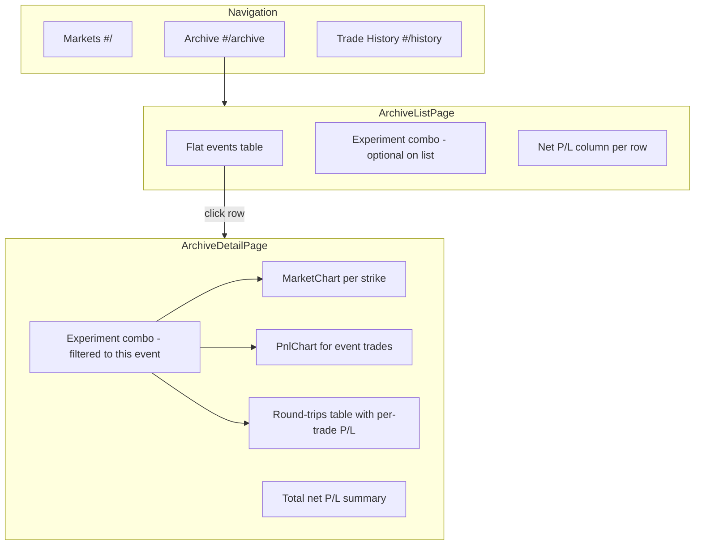

# Archive Tab with Trade P/L

## What you asked for

- A **separate Archive tab** (not the collapsible panel on Markets)
- **List view**: table of archived settled bets; show **net profit/loss** when the selected experiment traded that bet
- **Detail view** (open a row): full **bet signal** (price/flow/rules charts for all strikes), and if that experiment has trades in this period — **plot + table** with **total net P/L** and **per-trade net P/L**

There is no standalone “signals” module in the repo; “signal” here means the **full archived bet view** (same chart experience as live markets, but read-only/historical).

## Current state

| Piece | Location | Notes |
|-------|----------|-------|
| Archive data | [`ui/server/archive.py`](ui/server/archive.py) | Settled liquid bets; tree + flat events + per-event markets |
| Archive UI (embedded) | [`ui/web/src/components/ArchivePanel.tsx`](ui/web/src/components/ArchivePanel.tsx) | Collapsible tree at bottom of Markets — **will be removed** |
| Nav / routing | [`ui/web/src/components/AppNav.tsx`](ui/web/src/components/AppNav.tsx), [`ui/web/src/lib/routes.ts`](ui/web/src/lib/routes.ts) | Only Markets + Trade History today |
| Charts | [`ui/web/src/components/MarketChart.tsx`](ui/web/src/components/MarketChart.tsx) | Already loads historical data and stops polling when `closed: true` |
| User trades API | [`trader/app/api.py`](trader/app/api.py) | `GET .../round_trips?ticker=` and `.../fills?ticker=` already exist |
| Detail P/L patterns | [`ui/web/src/pages/ExperimentDetailPage.tsx`](ui/web/src/pages/ExperimentDetailPage.tsx) | Round-trip table + `PnlChart` + `PnlCell` to reuse |

## Architecture

## Backend (small addition)

Add one trader endpoint so the experiment dropdown can be **filtered to sessions that actually traded this archived bet**:

**`GET /api/trading/experiments/by_event/{event_ticker}`**

- Join `trading.fills` (or `round_trips`) → `markets.event_ticker`
- Return `{ id, name, mode, trade_count, net_pnl }` sorted by most recent activity
- Implement in [`trader/app/store.py`](trader/app/store.py) + [`trader/app/api.py`](trader/app/api.py)
- Exposed through existing UI proxy at `/api/trading/...`

Optional helper for list-page performance (can defer to v2):

**`GET /api/trading/experiments/{exp_id}/archive_pnl`** — map `event_ticker → net_pnl` for all archived events that experiment traded (one query). Not required for first cut if list loads ≤40 events and one `fetchRoundTrips(expId)` call is acceptable.

## Frontend changes

### 1. Routing and nav

Update [`ui/web/src/lib/routes.ts`](ui/web/src/lib/routes.ts):

- `#/archive` → list
- `#/archive/{event_ticker}` → detail

Update [`ui/web/src/App.tsx`](ui/web/src/App.tsx) to render new pages; remove `<ArchivePanel />` from Markets dashboard.

Update [`ui/web/src/components/AppNav.tsx`](ui/web/src/components/AppNav.tsx): add **Archive** tab (`active: "archive"`).

Add `fetchArchiveEvents()` to [`ui/web/src/api.ts`](ui/web/src/api.ts) (backend route already exists: `GET /api/archive/events`).

### 2. Archive list page — `ui/web/src/pages/ArchivePage.tsx`

- Fetch flat archived events via `fetchArchiveEvents(limit)`
- Subscribe to `marketStore.subscribeArchive()` to refresh when WS sends `{ t: "archived" }` (same as today’s panel)
- **Table columns**: Series, Bet name, Window title, Volume, Strikes, Closed time, **Net P/L**
- Row click → `#/archive/{event_ticker}`
- **Experiment combo** at page top (optional on list): when selected, compute P/L per row by:
  - Fetching `fetchRoundTrips(experimentId)` once
  - Grouping trips where `markets.event_ticker` matches (use ticker→event map built from archive data, or strip `-T…` suffix as fallback)
- P/L cell: `PnlCell` when traded, em dash when not
- Reuse date/volume formatters from [`ArchivePanel.tsx`](ui/web/src/components/ArchivePanel.tsx) before deleting it

### 3. Archive detail page — `ui/web/src/pages/ArchiveDetailPage.tsx`

Load sequence:

1. `fetchArchiveEventMarkets(eventTicker)` — all liquid strikes
2. `fetchExperimentsForEvent(eventTicker)` — **new API**; combo shows only experiments with ≥1 fill in this bet
3. Auto-select first experiment in list (or persist last choice in `sessionStorage`)
4. For selected experiment:
   - `fetchRoundTrips(experimentId, undefined, { start: open_time, end: close_time })` filtered client-side to event tickers
   - `fetchFills(...)` if needed for fill-level table

**Layout sections:**

| Section | Content |
|---------|---------|
| Header | Event title, ticker, window, settlement status, back link |
| Experiment picker | Combo — **only experiments that traded this bet** |
| Total P/L banner | Sum of closed `net_pnl` for this event + trade count |
| Signal / charts | One `MarketChart` per strike (sorted by floor_strike); tabs price / flow / rules |
| P/L plot | `PnlChart` built from filtered round-trips (only if trades exist) |
| Trades table | Closed round-trips: ticker, side, qty, entry, exit, **net P/L** per row (`PnlCell`) |

**Chart trade markers:** extend `MarketChart` with optional prop `roundTrips?: RoundTrip[]` so archive detail can pass pre-fetched trips instead of relying on `tradingStore` (which only caches the sidebar’s selected ticker). Keep existing `useRoundTrips(ticker)` as fallback for live Markets.

**Kalshi links:** build URLs client-side from `series_ticker`, `event_ticker`, titles (mirror logic in [`ui/server/markets.py`](ui/server/markets.py)) or add `kalshi_url` fields to archive API response in a follow-up.

### 4. Shared helpers — `ui/web/src/lib/archivePnl.ts`

- `eventTickerFromMarketTicker(ticker)` — strip `-T…` suffix
- `filterTripsForEvent(trips, eventTicker, marketTickers?)`
- `sumNetPnl(trips)` — total for banner and list column

### 5. Cleanup

- Delete or gut [`ArchivePanel.tsx`](ui/web/src/components/ArchivePanel.tsx) after moving logic to `ArchivePage`
- Update Markets header copy in [`App.tsx`](ui/web/src/App.tsx) to point users to the Archive tab

## UI behavior summary

| View | Experiment picker | P/L shown |
|------|-------------------|-----------|
| Archive list | Optional global combo | Per-row net P/L for selected experiment (— if no trades) |
| Archive detail | **Required**; only experiments with trades in **this** bet | Total banner + per-row in table + markers on chart |

## Files to touch (priority order)

1. [`trader/app/store.py`](trader/app/store.py) + [`trader/app/api.py`](trader/app/api.py) — `by_event` experiments query
2. [`ui/web/src/api/trading.ts`](ui/web/src/api/trading.ts) — client wrapper
3. [`ui/web/src/lib/routes.ts`](ui/web/src/lib/routes.ts) + [`App.tsx`](ui/web/src/App.tsx) + [`AppNav.tsx`](ui/web/src/components/AppNav.tsx)
4. **New** [`ui/web/src/pages/ArchivePage.tsx`](ui/web/src/pages/ArchivePage.tsx)
5. **New** [`ui/web/src/pages/ArchiveDetailPage.tsx`](ui/web/src/pages/ArchiveDetailPage.tsx)
6. [`ui/web/src/components/MarketChart.tsx`](ui/web/src/components/MarketChart.tsx) — optional `roundTrips` prop
7. **New** [`ui/web/src/lib/archivePnl.ts`](ui/web/src/lib/archivePnl.ts)
8. [`ui/web/src/api.ts`](ui/web/src/api.ts) — `fetchArchiveEvents`
9. Remove [`ArchivePanel.tsx`](ui/web/src/components/ArchivePanel.tsx) usage

## Test plan

- Navigate to `#/archive` — flat table loads settled bets; Markets page no longer shows archive panel
- Open a bet you never traded — experiment combo empty; charts still render from historical API
- Open a bet you traded in one paper experiment — combo shows only that experiment; total P/L matches sum of table rows
- Chart markers appear at entry/exit for traded strikes
- WS archive event (market settles) refreshes list without reload
- Trader unit test: `by_event` returns correct experiments for a known `event_ticker`
