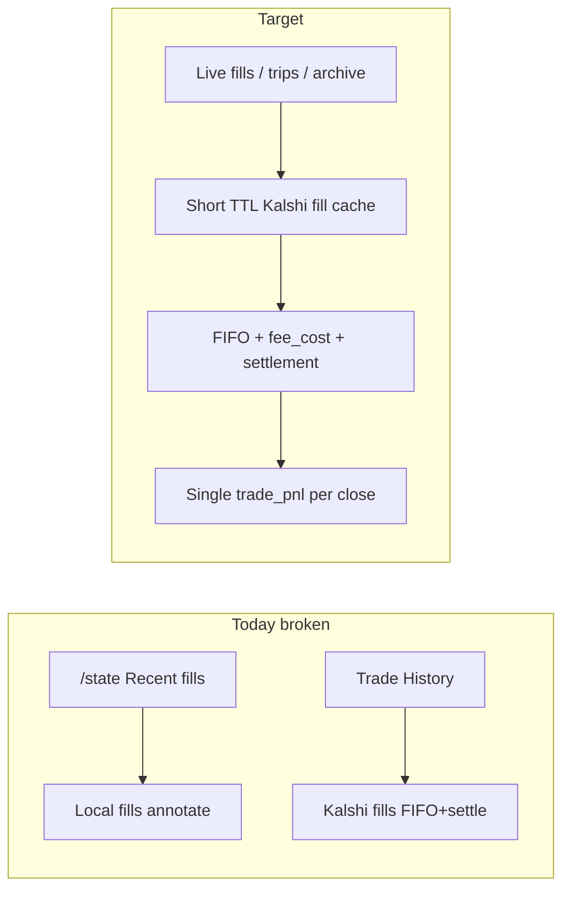

# Fix Live Trade P&L (Kalshi-first)

## Diagnosis

Kalshi’s standard `GET /portfolio/fills` has **no** `realized_pnl` field (only margin API does). Correct live P&L must use Kalshi fill economics (`yes_price_dollars` / `no_price_dollars`, `count_fp`, `fee_cost`) plus settlement closes from `GET /markets/{ticker}` — already implemented in [`trader/app/fill_analysis.py`](trader/app/fill_analysis.py).

Current bugs causing wrong / missing P&L:

1. **Split sources** — Trade History (`/fills`, `/round_trips`, `source=auto`) uses Kalshi + FIFO + settlements. Live dashboard [`GET .../state`](trader/app/api.py) always uses **local DB** fills + `annotate_fills_pnl` (no settlement overlay). Sidebar “Recent fills” can disagree with History.
2. **Double `trade_pnl` attribution** — `annotate_fills_pnl` puts realized P&L on **sells**; `annotate_fills_pnl_with_settlements` then also writes P&L onto **entry buys**. History “Fills” and “P&L only” can show the same close twice.
3. **Local ledger understates fees** — [`_open_round_trip`](trader/app/ledger.py) inserts `fees=0`; close only adds exit-fee share. Local `round_trips.net_pnl` / archive list SQL ignore entry fees.
4. **Archive list vs detail** — [`list_archive_pnl`](trader/app/store.py) sums local `round_trips`; Archive detail for live re-simulates from Kalshi → different Net P/L.

## Approach (concrete)

**Live = Kalshi fills + post-calc FIFO (required).** Account **Total P&L** stays Kalshi `equity − deposits` via [`build_profile`](trader/app/pnl.py). Per-trade / realized fill P&L uses existing FIFO helpers; no margin API.

**Paper = local ledger** (unchanged source), but fix entry-fee accounting so local `net_pnl` matches the same FIFO formula.

## Implementation

### 1. Harden Kalshi fill normalize + single P&L attribution

In [`trader/app/fill_analysis.py`](trader/app/fill_analysis.py):

- Prefer legacy `action`/`side` when present; if missing, derive from `outcome_side` + `book_side` using the Kalshi equivalence table (and never default every fill to `action=buy`).
- Price: use the price for the **contract side** being tracked (`yes_price_dollars` / `no_price_dollars`).
- Keep `fee_cost` from Kalshi as fee (already dollars).
- Rewrite annotation so **exactly one fill** gets `trade_pnl` per closed lot:
  - Normal close → closing **sell** fill
  - Settlement-only → entry **buy** fill (no sell exists)
- Clear the opposite side so History and “P&L only” never double-count.

### 2. Live `/state` uses same analysis path (cached)

In [`trader/app/api.py`](trader/app/api.py) `get_state`:

- If `exp.mode == "live"` and Kalshi configured: load fills via existing `_analysis_fills(..., source="kalshi")` + `_annotate_fills_for_analysis` / `_round_trips_for_analysis` (settlement-aware).
- Add a small in-process TTL cache (~15–20s) around `fetch_all_kalshi_fills` so 2–10s UI polling does not hammer Kalshi.
- Paper `/state` stays on local fills.

Also make chart `round_trips` for a selected ticker on live come from the same simulated trips (not only `store.list_round_trips`).

### 3. Fix local ledger fees (paper + live sync fallback)

In [`trader/app/ledger.py`](trader/app/ledger.py):

- `_open_round_trip(..., fee)` store entry fee in `fees`.
- On close: `rt_fees = stored_entry_fees_share + exit_fee_share` (same as FIFO in `fill_analysis`).
- Pass fill fee into `_open_round_trip` from `apply_fill_tx`.

### 4. Align live Archive list P&L

In [`trader/app/api.py`](trader/app/api.py) `list_archive_pnl`:

- For **live** experiments: Kalshi fills → `simulate_round_trips_with_settlements` → group `net_pnl` by `event_ticker` (reuse store ticker→event map).
- Paper: keep SQL `SUM(round_trips.net_pnl)`.

### 5. Tests

Add [`trader/tests/test_fill_analysis.py`](trader/tests/test_fill_analysis.py):

- Normalize fill with `fee_cost` + yes/no prices
- Buy then sell → `trade_pnl` only on sell; net = gross − entry_fee − exit_fee
- Settlement close → `trade_pnl` only on entry buy
- `annotate_fills_pnl_with_settlements` does not duplicate P&L on both legs
- Ledger open stores entry fee; closed `net_pnl` matches FIFO

Run: `python -m pytest trader/tests -q`

## Files to touch

| Priority | File | Change |
|----------|------|--------|
| 1 | [`trader/app/fill_analysis.py`](trader/app/fill_analysis.py) | Normalize + single attribution |
| 2 | [`trader/app/api.py`](trader/app/api.py) | Live `/state` + live `archive_pnl` + fill cache |
| 3 | [`trader/app/ledger.py`](trader/app/ledger.py) | Entry fee on round trips |
| 4 | [`trader/tests/test_fill_analysis.py`](trader/tests/test_fill_analysis.py) | New unit tests |

UI changes not required if API payloads stay the same shape (`trade_pnl`, `net_pnl`); [`TradingSidebar`](ui/web/src/components/TradingSidebar.tsx) / History / Archive already render those fields.

## Verification

1. Live experiment: sidebar Recent fills P&L matches Trade History fills for the same close (one row with P&L).
2. Settled market with no sell: P&L appears once (entry or settlement trip), fees include entry `fee_cost`.
3. Archive list Net P/L for a live experiment matches Archive detail total for that event.
4. Paper experiment: closed trip `net_pnl` includes entry+exit fees; pytest green.