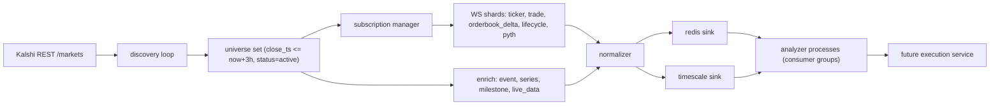
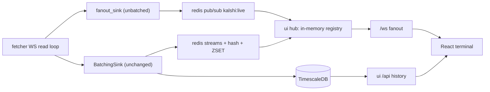
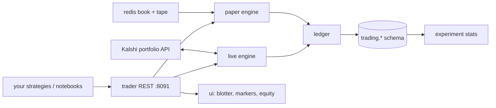

# Kalshi Live Market Data Pipeline

## Goal

Two services, one compose file. `fetcher/` streams every "live" Kalshi market as fast as the API allows; `storage/` owns a two-tier database that many analyzer processes can read concurrently without fighting each other. No trading logic yet, but the schema and the Redis keyspace are shaped so a future execution service just plugs in.

## Repository layout

```
.
├── docker-compose.yml          # timescaledb, redis, migrator, fetcher
├── .env.example                # KALSHI_KEY_ID, KALSHI_PRIVATE_KEY_PATH, DB urls
├── README.md
├── common/                     # shared library (no Dockerfile, pip-installed into images)
│   ├── models.py               # msgspec.Struct normalized events
│   ├── settings.py             # pydantic-settings, env + YAML
│   └── logging.py              # structlog JSON
├── storage/
│   ├── Dockerfile              # one-shot migration runner
│   ├── migrations/001_init.sql
│   ├── redis.conf
│   └── clients/
│       ├── redis_store.py
│       └── timescale_store.py
└── fetcher/
    ├── Dockerfile
    ├── requirements.txt
    ├── config.yaml             # filters + channels + tuning
    └── app/
        ├── main.py             # asyncio.TaskGroup wiring
        ├── kalshi/{auth,rest,ws}.py
        ├── discovery.py        # universe scanner
        ├── filters.py          # pluggable predicates
        ├── handlers/{ticker,trade,orderbook,lifecycle,underlying}.py
        ├── enrich.py           # events / series / milestones / live_data
        └── sinks/{base,redis_sink,timescale_sink}.py
```

## Architecture



## 1. Kalshi client (`fetcher/app/kalshi/`) — highest priority

- `auth.py`: RSA-PSS signer. Sign `timestamp + METHOD + path` (path without query), send `KALSHI-ACCESS-KEY`, `KALSHI-ACCESS-SIGNATURE`, `KALSHI-ACCESS-TIMESTAMP`. Same signer for REST and the WS handshake on `/trade-api/ws/v2`.
- `rest.py`: `httpx.AsyncClient` with HTTP/2, cursor pagination helper, and a token-bucket limiter (`rest_rps` in config) since limits are tier-based.
- `ws.py`: connects to `wss://external-api-ws.kalshi.com/trade-api/ws/v2`, exponential-backoff reconnect, and a `SubscriptionManager` that uses the `update_subscription` command (`action: add_markets` / `delete_markets`) to mutate the ticker list in place rather than tearing down subscriptions.
- **Sharding**: hash tickers across `ws_shards` connections (default 4). Error code 25 is "subscription buffer overflow" — sharding plus a bounded `asyncio.Queue` per connection is the defense. The read loop only decodes and enqueues; all DB work happens in separate consumer tasks so a slow write can never stall the socket.

## 2. Discovery + filters (`discovery.py`, `filters.py`)

Every `discovery_interval_sec` (default 30):

```python
# status MUST be empty: min/max_close_ts are only compatible with `closed` or empty
params = {"min_close_ts": now, "max_close_ts": now + max_hours*3600, "limit": 1000}
```

Then apply pluggable predicates from `config.yaml`, each a small function registered in a dict:

- `status_active` — object status is `active` (the query enum `open` differs from the object enum `active`).
- `time_to_close` — `close_time - now <= max_hours` (default 3, configurable).
- `market_duration` — `close_time - open_time <= max_duration_hours` (default 3). This is the BTC-hourly-style filter you described: the whole bet starts and ends inside the window.
- `category_allowlist` — optional series/category list, empty means all.

Diff against the current universe, then add/remove WS subscriptions and enqueue enrichment for newcomers. Removal happens on `market_lifecycle_v2` close events too, so we drop dead markets instantly rather than waiting for the next scan.

## 3. Data captured

Live channels: `ticker` (quotes, volume, open interest), `trade` (prints with taker side), `orderbook_delta` + `orderbook_snapshot` (full L2, both sides), `market_lifecycle_v2` (open/close/settle), and `pyth_value` / `cfbenchmarks_value` for the underlying spot price behind crypto markets.

Metadata via REST on first sight: `GET /markets/{ticker}`, `/events/{event_ticker}`, `/series/{series_ticker}`, plus `/milestones` and `/live_data/*` (play-by-play game stats for sports, price/weather series for others). This is what makes the rows analyzable rather than just quotes.

Two correctness rules baked in:
- **Fixed-point only.** `yes_bid_dollars`, `volume_fp`, `open_interest_fp` are strings. Parse to `Decimal`, store as `NUMERIC`. No floats anywhere in the price path.
- **Sequence gaps.** `orderbook_delta` carries `seq`; on a gap, drop the local book, re-request a snapshot via `GET /markets/{ticker}/orderbook`, and mark the book stale in Redis so analyzers can skip it.

## 4. Storage (`storage/`)

**Redis — hot tier, sub-millisecond.**

- `kalshi:universe` SET of live tickers
- `kalshi:market:{ticker}` HASH — metadata plus latest quote, one `HSET` per update
- `kalshi:book:{ticker}:{yes,no}` ZSET price to size
- `kalshi:stream:{ticks,trades,book,underlying}` Streams with `MAXLEN ~`
- `kalshi:chan:{ticker}` pub/sub for lowest-latency fanout

Streams with **consumer groups** are the answer to parallel processing: N analyzer processes join a group and each message goes to exactly one worker, with pending-entry tracking for crash recovery. Analyzers that all need every message use pub/sub or their own group instead.

**TimescaleDB — durable history for backtesting.**

Hypertables `ticks`, `trades`, `book_deltas`, `underlying_prices`, `lifecycle_events`, all `(ts, ticker)`, plus a regular `markets` dimension table upserted on enrichment. Compression after 1 day, retention configurable, and a continuous aggregate for 1-second OHLCV. Writes go through `asyncpg.copy_records_to_table` batched at 1000 rows or 100ms, whichever comes first — an order of magnitude faster than row-by-row inserts.

Both sinks implement the same `Sink` protocol (`async def write(self, batch)`), so adding ClickHouse or Kafka later is a new file and one config line.

## 5. Docker

`docker-compose.yml` at root: `timescaledb` (timescale/timescaledb:latest-pg17, tuned shared_buffers), `redis` (7-alpine, appendonly off, maxmemory-policy noeviction), `migrator` (one-shot, `service_completed_successfully` gate), `fetcher`. Build context is the repo root so `common/` can be copied into both images. Each service gets its own multi-stage Dockerfile on `python:3.12-slim` running as a non-root user.

## 6. Latency measures

uvloop, `msgspec` for decode (faster than orjson for typed structs), decode-and-enqueue read loop, pipelined Redis writes, batched COPY, WS permessage-deflate disabled to trade bandwidth for CPU. A `/metrics` endpoint exposes end-to-end lag (exchange timestamp to DB commit), queue depth, reconnects, and sequence gaps so we can prove where time goes.

## Open items

- You need a Kalshi API key pair (RSA). `.env.example` will support the demo host so the pipeline can run before keys are live.
- Universe size at a 3h window across all categories is unknown until first run; if it lands in the thousands, we raise `ws_shards`. The metrics will tell us.

---

# Part II — `ui/` service (live trading terminal) 🖥️

## Goal

A third service in its own folder, same shape as `fetcher/` and `storage/`: shared `common/` lib, own `Dockerfile`, own `config.yaml`, one line in `docker-compose.yml`. Two screens — a live list of every market in the universe, and a market detail view modelled on the Kalshi `KXBTC15M` page (real-time underlying chart, "Price to beat" line, YES/NO cards, countdown, order book, trade tape, rules, Past tab).

Read-only in phase 1. No order entry, no keys in the browser. Phase 2 hooks into the future execution service.

## What "fast" has to mean here

The current write path is `WS → normalize → BatchingSink(1000 rows | 100 ms) → Redis → Timescale`. **A UI that reads Redis today inherits a 100 ms floor before a single pixel can move.** Two things in the existing code block us:

1. `BatchingSink` holds events up to `sink_flush_ms: 100`.
2. `RedisStore._apply_tick` publishes `{"kind":"tick","ticker":...}` — a *notification with no data*, forcing the reader into an extra `HGETALL` round trip per update.

So step 1 is not UI code at all, it is opening a fast path in the fetcher. Target budget, exchange timestamp to painted pixel, on localhost:

| Hop | Budget |
|---|---|
| Kalshi WS → fetcher decode | ~1 ms |
| fetcher → Redis pub/sub (`kalshi:live`, fire-and-forget) | ~0.3 ms |
| Redis → gateway decode + state apply | ~0.5 ms |
| gateway → browser WS (focused market, uncoalesced) | ~1 ms |
| browser decode → canvas paint (next rAF) | ≤16 ms |
| **Total p50** | **≈ 20 ms** |

The durable path (`BatchingSink` → streams + Timescale) stays exactly as it is. We add a parallel lane, we do not touch the existing one.

## Repository layout (additions only)

```
ui/
├── Dockerfile                  # multi-stage: node build web/ → python runtime serves it
├── requirements.txt
├── config.yaml                 # symbol_map, flush knobs, history windows
├── server/
│   ├── main.py                 # FastAPI app + uvloop, TaskGroup wiring
│   ├── hub.py                  # in-memory MarketState registry + fanout
│   ├── feed.py                 # Redis pub/sub reader + cold-start rehydrate
│   ├── ws.py                   # /ws endpoint, per-client subscription state
│   ├── rest.py                 # /api/* history + snapshot routes
│   └── codec.py                # msgspec msgpack encode/decode, price_e4 helpers
└── web/
    ├── package.json            # vite, react, typescript, tailwind, lightweight-charts
    ├── vite.config.ts          # dev proxy /api + /ws → :8090
    ├── index.html
    └── src/
        ├── main.tsx
        ├── store/market-store.ts   # external store, rAF flush, per-ticker listeners
        ├── net/socket.ts           # WS client, reconnect, msgpack decode
        ├── routes/List.tsx
        ├── routes/Market.tsx
        └── components/{PriceChart,BookLadder,TradeTape,Countdown,YesNoCards,LatencyHud}.tsx
```

## Architecture



---

# Exact steps, in priority order

## 1/14 — Open the fast path in `fetcher/` 🚀 *(blocks everything; highest latency win)*

**New** `fetcher/app/sinks/fanout_sink.py`:

```python
class FanoutSink:
    """Unbatched, fire-and-forget publish for the UI. Never raises into the read loop."""

    CHANNEL = "kalshi:live"

    def __init__(self, store: RedisStore) -> None:
        self._store = store
        self._enc = msgspec.msgpack.Encoder(enc_hook=str)  # Decimal -> str
        self.published = 0
        self.drops = 0

    async def publish(self, events: list[NormalizedEvent]) -> None:
        try:
            pipe = self._store.client.pipeline(transaction=False)
            for ev in events:
                pipe.publish(self.CHANNEL, self._enc.encode(ev))
            await pipe.execute()
            self.published += len(events)
        except Exception:
            self.drops += len(events)   # UI lag must never stall ingestion
```

**Edit** `fetcher/app/main.py` — one call in `_route_ws_message`, before the existing enqueue:

```python
if events:
    if self.fanout:
        await self.fanout.publish(events)     # ~0.3ms, unbatched
    await self.sink.enqueue(events)           # unchanged durable path
```

**Edit** `fetcher/config.yaml` + `common/settings.py`: add `ui_fanout: true`.

**Edit** the handlers to populate `NormalizedEvent.source_ts` — the field already exists on the struct and nothing writes it. Pull `body.get("ts")` (Kalshi sends epoch seconds on `ticker`/`trade`) so we can measure true exchange-to-screen latency rather than gateway-to-screen.

*Done when:* `redis-cli SUBSCRIBE kalshi:live` prints traffic, and `/metrics` shows `fanout_published` climbing in step with `messages_received`.

## 2/14 — Schema for the chart 📊

**New** `storage/migrations/002_ui.sql`. The existing `ohlcv_1s` aggregate only carries `last_price`, which on a 15-minute market is sparse and jumpy — the odds line needs the *mid*, and the candle chart needs the underlying, which has no aggregate at all.

- `market_1s` continuous aggregate: `time_bucket('1 second', ts)`, `ticker`, OHLC of `last_price`, plus `last(yes_bid, ts)` / `last(yes_ask, ts)` / `last(volume, ts)`. Mid is computed at query time so we never store a derived float.
- `underlying_1s` continuous aggregate on `underlying_prices`: OHLC per `(bucket, source, symbol)` — this is the BTC candlestick source.
- `CREATE INDEX idx_underlying_symbol_ts ON underlying_prices (symbol, ts DESC)`.
- `v_market_card` view: `markets` joined to `metadata->'market'` extracting `floor_strike`, `cap_strike`, `strike_type`, `rules_primary` — this is where "Price to beat: $88,207.22" comes from.

The migrator already runs every file in `migrations/` in order, so this needs no compose change.

## 3/14 — Scaffold `ui/` 🧱

`ui/requirements.txt`: `fastapi`, `uvicorn[standard]`, `redis`, `asyncpg`, `msgspec`, `uvloop`, `structlog`, `pydantic-settings`, `PyYAML`.

`ui/config.yaml`:

```yaml
list_flush_ms: 50        # coalesce list-view frames
market_flush_ms: 0       # focused market: never coalesce
trade_ring_size: 200
history_windows: [5m, 15m, 1h]
symbol_map:              # market series -> underlying feed symbol
  KXBTC15M: BTC/USD
  KXETH15M: ETH/USD
```

`common/settings.py`: add `UiSettings(BaseSettings)` reusing the same `load()` YAML+env pattern as `FetcherSettings`, so config behaves identically across services.

## 4/14 — The hub: one Redis reader, one in-memory truth 🧠

`ui/server/hub.py`. This is the core design call: **one** Redis connection for the whole process, not one per browser.

```python
@dataclass
class MarketState:
    meta: dict          # from markets table / kalshi:market hash
    quote: dict         # yes_bid, yes_ask, last, volume, oi (price_e4 ints)
    book: dict[str, dict[int, int]]   # side -> {price_e4: size}
    trades: deque       # bounded ring, newest first
    seq: int            # bumped on every mutation, used for delta framing
```

`feed.py` runs two things:

- **Cold start** — `SMEMBERS kalshi:universe` → pipelined `HGETALL kalshi:market:{t}` + `ZRANGE kalshi:book:{t}:{yes,no}` → `XREVRANGE kalshi:stream:trades` for tape backfill. The gateway is fully warm before it accepts its first socket, so page load is instant and needs zero Redis round trips.
- **Live loop** — `PSUBSCRIBE kalshi:live`, decode msgpack, mutate `MarketState`, mark the ticker dirty, push to interested client queues. Decode-and-apply only; all socket writes happen in per-client writer tasks, mirroring the fetcher's read-loop discipline so one slow browser cannot stall the feed.

Universe adds/removes are picked up from the `lifecycle` events already flowing through the same channel.

## 5/14 — WebSocket protocol 🔌

`ui/server/ws.py`. Binary msgpack frames. Prices travel as `price_e4` (integer tenth-cents, `round(dollars * 10_000)`) so nothing in the price path is ever a float, matching the fixed-point rule from Part I.

Client → server:

```json
{"op":"sub","view":"list"}
{"op":"sub","view":"market","ticker":"KXBTC15M-26AUG010100"}
{"op":"ping","t":1234567890}
```

Server → client: one `snapshot` frame on subscribe, then `delta` frames.

```json
{"t":"delta","k":"quote","m":"KXBTC15M-...","yb":5300,"ya":5500,"ts":...,"st":...}
{"t":"delta","k":"book","m":"...","s":"yes","p":5300,"z":142}
{"t":"delta","k":"trade","m":"...","p":5400,"c":25,"side":"yes"}
{"t":"delta","k":"under","sym":"BTC/USD","p":881234500}
```

Two policies, and this is the point of the whole design:

- **List view is coalesced.** Per-client `dirty: set[str]`, flushed every `list_flush_ms` (50 ms) as one frame carrying only changed fields for tickers the client actually has on screen. 500 markets × 5 updates/sec would be 2500 msg/s of pointless churn; coalescing makes it ~20 frames/s.
- **Focused market is never coalesced.** Every event for the open ticker ships the instant it lands. This is where latency is visible and where we spend it.

Per-client queue is bounded and **drop-oldest with a resync flag**: if a browser falls behind, we discard stale deltas and send a fresh snapshot rather than growing a queue. A slow client degrades itself and nothing else.

## 6/14 — REST for everything that is not hot 🗂️

`ui/server/rest.py`. List and snapshot routes read the hub's memory (no Redis, no SQL, sub-millisecond). Only history touches Timescale.

- `GET /api/markets` — universe with live quotes, from memory
- `GET /api/markets/{ticker}` — meta + quote + book + strike/price-to-beat + rules
- `GET /api/markets/{ticker}/history?range=15m` — odds line from `market_1s`
- `GET /api/markets/{ticker}/underlying?range=15m` — candles from `underlying_1s` via `symbol_map`
- `GET /api/markets/{ticker}/trades?limit=200` — tape backfill
- `GET /api/series/{series}/past?limit=7` — settled prior windows, the Kalshi "Past" tab
- `GET /healthz`, `GET /metrics` — same JSON shape as the fetcher's

## 7/14 — Frontend scaffold 🎨

Vite + React 18 + TypeScript + Tailwind. Dark terminal theme: near-black `#0B0E11` canvas, `#12161C` panels, `#0ECB81` / `#F6465D` for yes/no, Inter + tabular numerals so digits never reflow as they change. Routes `/` and `/m/:ticker`. Dev proxy sends `/api` and `/ws` to `:8090` so `npm run dev` gives hot reload against the live pipeline.

## 8/14 — The store, and why it lives outside React ⚡

`ui/web/src/store/market-store.ts`. React cannot re-render a list at market data rates, so it never sees them:

- A plain `Map<string, MarketState>` mutated directly by the socket handler.
- `subscribe(ticker, cb)` — **per-ticker** listeners. A tick on one market notifies exactly one row.
- Socket handler marks tickers dirty; a single `requestAnimationFrame` flush notifies dirty listeners and clears the set. Ten updates inside one frame cost one paint.
- Components read via `useSyncExternalStore`, so there is no context, no reducer, and no parent re-render.

Everything genuinely hot — the depth ladder, the chart — skips this and draws to canvas directly.

## 9/14 — Market list screen 📋

Virtualized with `@tanstack/react-virtual` (only visible rows mount, and only visible rows are subscribed on the server). Per row: title, YES/NO cents with spread, last, volume, open interest, and a live countdown to close. Cells flash green/red on change by toggling a CSS class on the DOM node — no React state, so a flash costs nothing. Sort defaults to soonest-close-first, which is what actually matters in a 3 hour universe. Filters for series, category, and "closing under 15m".

## 10/14 — Market detail screen, matched to the Kalshi page 🎯

Reference: `kalshi.com/markets/kxbtc15m/bitcoin-price-up-down/...`. Layout, left to right:

- **Header** — event title ("BTC Up or Down - 15 minutes"), `LIVE` badge, 24h volume, and a countdown to close.
- **Chart panel** (step 11) with `5m / 15m / 1H` range tabs and a `Past` tab.
- **Price to beat** — `$88,207.22`, pulled from `v_market_card` strike, pinned above the chart and drawn on it.
- **YES / NO cards** — big cents + implied percentage, best bid/ask, driven straight off the store.
- **Order book** (step 12) — yes/no ladders with cumulative depth bars.
- **Recent activity** — trade tape with taker side colouring.
- **Rules** — the CF Benchmarks 60-second-average settlement text from `rules_primary`.
- **Past** — last 7 settled windows for the series with their outcomes, so the same "was it up or down" pattern read is available.

Ordering panel is stubbed and visibly disabled in phase 1.

## 11/14 — The chart 📈

`lightweight-charts` (TradingView, canvas, ~45 KB) in `PriceChart.tsx`:

- Candlestick series — underlying BTC from `underlying_1s`.
- `createPriceLine` — the dashed "price to beat" strike.
- Line series on the right scale — YES probability (mid), so you see the odds react to spot in the same viewport.
- Seed once with `setData(history)`, then **only ever `series.update(bar)`** from the live socket. Calling `setData` on every tick is the classic mistake that turns a 60fps chart into a 5fps one.
- Range tabs re-fetch history; live updates continue uninterrupted underneath.

## 12/14 — Ladder and tape on raw canvas 🕯️

`BookLadder.tsx` mounts a `<canvas>`, reads `MarketState.book` on rAF, and paints price/size/cumulative-depth bars itself. The book is the highest-churn widget on the page; keeping it out of the DOM entirely is the difference between smooth and janky. `TradeTape.tsx` does the same against the bounded trade ring.

## 13/14 — Prove the latency 🔬

Every event carries its stamps: `t_exchange` (from `source_ts`, step 1) → `t_ingest` → `t_pub` → `t_gateway` → `t_send`, and the browser adds `t_recv` and `t_paint`. A corner HUD shows live p50/p99 for each hop plus frame time and message rate; `/metrics` exposes the same server-side. Without this "low latency" is an assertion; with it, it is a number we can regress against.

## 14/14 — Ship it 🐳

`ui/Dockerfile`, multi-stage, mirroring `fetcher/Dockerfile` conventions (non-root `appuser`, `PYTHONPATH=/app`, `common/` and `storage/` copied in):

```dockerfile
FROM node:22-alpine AS web
WORKDIR /web
COPY ui/web/package*.json ./
RUN npm ci
COPY ui/web .
RUN npm run build

FROM python:3.12-slim
# ... same base as fetcher/Dockerfile ...
COPY --from=web /web/dist /app/ui/web/dist
CMD ["uvicorn", "ui.server.main:app", "--host", "0.0.0.0", "--port", "8090", "--loop", "uvloop"]
```

Compose service `ui` on `8090` (8080 is the fetcher's), `depends_on` redis + timescale healthy and migrator completed, build context the repo root. README gains a `ui` row in the services table and the two screen URLs.

## Acceptance criteria

- Cold `docker compose up --build`, open `:8090`, the list is populated before the first frame paints (hub is pre-warmed).
- Open a `KXBTC15M` market: candles, price-to-beat line, odds overlay, book and tape all live.
- HUD p50 exchange-to-paint under ~30 ms locally; p99 under ~80 ms.
- List view holds 60fps with 500+ markets streaming.
- Killing the `ui` container does not perturb `fetcher` throughput or `/metrics`.

## Decisions worth confirming before code

- **Read-only vs order entry.** Plan above is read-only. Order entry means Kalshi portfolio endpoints, a server-side session, and risk limits — real scope, better as its own phase against the future execution service.
- **FastAPI vs aiohttp.** The repo already depends on `aiohttp` (the fetcher's metrics server). FastAPI is proposed for the richer WS and routing ergonomics; staying on `aiohttp` keeps the dependency set identical. Both hit the same latency.
- **`symbol_map` coverage.** Only useful for crypto series where a `pyth_value` / `cfbenchmarks_value` feed exists. Non-crypto markets get the odds line and no candles, which is also what Kalshi shows.

---

# Part III — `trader/` service (execution + experiment ledger) 💰

## Why this is not part of `ui/`

The UI is a *view*. Orders, positions and money are not. If the order engine lived inside the UI process, restarting a React build or killing a leaking WebSocket would take open orders down with it. So `trader/` is its own service, its own folder, its own port — exactly the "future execution service" Part I anticipated. `ui/` calls it over HTTP and renders what it returns; strategies and notebooks call the same API directly.



## Repository layout (additions)

```
trader/
├── Dockerfile
├── requirements.txt
├── config.yaml                 # fee model, fill realism, guards
└── app/
    ├── main.py                 # FastAPI :8091
    ├── api.py                  # REST surface
    ├── experiments.py          # CRUD, capital, mode switch, reset
    ├── ledger.py               # orders/fills/positions persistence
    ├── pnl.py                  # FIFO round-trips, mark-to-market, settlement
    ├── store.py                # asyncpg queries on the trading schema
    └── engine/
        ├── base.py             # ExecutionEngine protocol
        ├── paper.py            # simulated fills off the live book
        └── live.py             # real Kalshi orders
common/kalshi/                  # promoted from fetcher/app/kalshi/
```

## 15/23 — Share the Kalshi client 🔁

`KalshiRest` today is GET-only and lives under `fetcher/`. Move `auth.py` / `rest.py` / `ws.py` to `common/kalshi/`, update the fetcher's imports, and add:

- `post(path, body)` / `delete(path)` — the signer already handles `timestamp + METHOD + path`, so signing POST is the same code path.
- `create_order`, `cancel_order`, `get_orders`, `get_positions`, `get_fills`, `get_balance` against `/portfolio/*`.
- Private WS channels `fills` and `market_positions` for real-time fill notification instead of polling.

## 16/23 — `trading` schema 🗄️

**Name collision warning:** a `trades` hypertable already exists for *market prints*. Trading tables therefore live in their own schema, which also makes reset and per-experiment isolation trivial. `storage/migrations/003_trading.sql`:

```sql
CREATE SCHEMA IF NOT EXISTS trading;

CREATE TABLE trading.experiments (
    id              UUID PRIMARY KEY DEFAULT gen_random_uuid(),
    name            TEXT UNIQUE NOT NULL,
    mode            TEXT NOT NULL DEFAULT 'paper'
                    CHECK (mode IN ('paper','live')),
    initial_capital NUMERIC(18,4) NOT NULL,
    cash            NUMERIC(18,4) NOT NULL,   -- settled cash, moves on every fill
    status          TEXT NOT NULL DEFAULT 'active',
    strategy        TEXT,
    params          JSONB DEFAULT '{}'::jsonb,
    created_at      TIMESTAMPTZ NOT NULL DEFAULT NOW(),
    archived_at     TIMESTAMPTZ
);

CREATE TABLE trading.orders (
    id              UUID PRIMARY KEY DEFAULT gen_random_uuid(),
    experiment_id   UUID NOT NULL REFERENCES trading.experiments(id) ON DELETE CASCADE,
    client_order_id TEXT UNIQUE,              -- caller-supplied idempotency key
    ticker          TEXT NOT NULL,
    side            TEXT NOT NULL CHECK (side IN ('yes','no')),
    action          TEXT NOT NULL CHECK (action IN ('buy','sell')),
    type            TEXT NOT NULL CHECK (type IN ('market','limit')),
    limit_price     NUMERIC(18,6),
    qty             NUMERIC(24,2) NOT NULL,
    filled_qty      NUMERIC(24,2) NOT NULL DEFAULT 0,
    status          TEXT NOT NULL DEFAULT 'pending',
    mode            TEXT NOT NULL,            -- denormalized: a live fill can never land on a paper row
    kalshi_order_id TEXT,
    reason          TEXT,                     -- rejection detail
    meta            JSONB DEFAULT '{}'::jsonb,
    created_at      TIMESTAMPTZ NOT NULL DEFAULT NOW(),
    updated_at      TIMESTAMPTZ NOT NULL DEFAULT NOW()
);

CREATE TABLE trading.fills (
    id            UUID PRIMARY KEY DEFAULT gen_random_uuid(),
    order_id      UUID NOT NULL REFERENCES trading.orders(id) ON DELETE CASCADE,
    experiment_id UUID NOT NULL REFERENCES trading.experiments(id) ON DELETE CASCADE,
    ts            TIMESTAMPTZ NOT NULL DEFAULT NOW(),
    ticker        TEXT NOT NULL,
    side          TEXT NOT NULL,
    action        TEXT NOT NULL,
    price         NUMERIC(18,6) NOT NULL,
    qty           NUMERIC(24,2) NOT NULL,
    fee           NUMERIC(18,6) NOT NULL DEFAULT 0,
    liquidity     TEXT,                       -- taker | maker
    meta          JSONB DEFAULT '{}'::jsonb
);

CREATE TABLE trading.positions (
    experiment_id UUID NOT NULL REFERENCES trading.experiments(id) ON DELETE CASCADE,
    ticker        TEXT NOT NULL,
    side          TEXT NOT NULL,
    qty           NUMERIC(24,2) NOT NULL DEFAULT 0,
    avg_price     NUMERIC(18,6) NOT NULL DEFAULT 0,
    realized_pnl  NUMERIC(18,6) NOT NULL DEFAULT 0,
    fees_paid     NUMERIC(18,6) NOT NULL DEFAULT 0,
    updated_at    TIMESTAMPTZ NOT NULL DEFAULT NOW(),
    PRIMARY KEY (experiment_id, ticker, side)
);

-- one row per completed (or open) round trip; this is what draws entry/exit on the chart
CREATE TABLE trading.round_trips (
    id            UUID PRIMARY KEY DEFAULT gen_random_uuid(),
    experiment_id UUID NOT NULL REFERENCES trading.experiments(id) ON DELETE CASCADE,
    ticker        TEXT NOT NULL,
    side          TEXT NOT NULL,
    qty           NUMERIC(24,2) NOT NULL,
    entry_ts      TIMESTAMPTZ NOT NULL,
    entry_price   NUMERIC(18,6) NOT NULL,
    exit_ts       TIMESTAMPTZ,
    exit_price    NUMERIC(18,6),
    exit_kind     TEXT,                       -- close | settle | expire
    gross_pnl     NUMERIC(18,6),
    fees          NUMERIC(18,6) NOT NULL DEFAULT 0,
    net_pnl       NUMERIC(18,6),
    hold_secs     INTEGER,
    meta          JSONB DEFAULT '{}'::jsonb
);

CREATE TABLE trading.equity_curve (
    ts            TIMESTAMPTZ NOT NULL,
    experiment_id UUID NOT NULL,
    cash          NUMERIC(18,4) NOT NULL,
    position_value NUMERIC(18,4) NOT NULL,
    equity        NUMERIC(18,4) NOT NULL,
    drawdown      NUMERIC(18,6) NOT NULL DEFAULT 0
);
SELECT create_hypertable('trading.equity_curve', 'ts', if_not_exists => TRUE);
```

Plus indexes on `(experiment_id, ts DESC)` everywhere, a `trading.experiment_stats` view (trade count, win rate, gross/net P&L, avg hold, max drawdown, profit factor), and:

```sql
CREATE FUNCTION trading.reset_experiment(exp UUID) RETURNS void AS $$
BEGIN
  IF (SELECT mode FROM trading.experiments WHERE id = exp) = 'live' THEN
    RAISE EXCEPTION 'refusing to reset a live experiment';   -- real money is not resettable
  END IF;
  DELETE FROM trading.orders WHERE experiment_id = exp;      -- fills cascade
  DELETE FROM trading.positions WHERE experiment_id = exp;
  DELETE FROM trading.round_trips WHERE experiment_id = exp;
  DELETE FROM trading.equity_curve WHERE experiment_id = exp;
  UPDATE trading.experiments SET cash = initial_capital WHERE id = exp;
END; $$ LANGUAGE plpgsql;
```

**On "a separate table per experiment":** ten physical tables would mean ten migrations and no cross-experiment queries. One set of tables keyed by `experiment_id` gives the same isolation (every read is scoped, reset is per-experiment, cascade delete is clean) plus the ability to rank all ten side by side. If you want it to *look* like separate tables, `trading.experiment_ledger(exp UUID)` returns a per-experiment set — say the word and I'll add per-experiment views too.

## 17/23 — Service scaffold 🧱

FastAPI on `:8091`. `trader/config.yaml`:

```yaml
fees:
  model: kalshi          # ceil(0.07 * qty * P * (1-P)) cents, maker = 0
  maker_bps: 0
fill:
  model: book_walk       # market orders consume real depth from the live book
  require_trade_through: false   # true = limits fill only after the tape prints through
  max_slippage_e4: 200
guards:
  max_order_qty: 1000
  max_position_per_market: 5000
  reject_if_book_stale: true
mark_interval_sec: 1     # equity curve sampling
```

## 18/23 — Experiments, capital, mode switching 🎛️

```
POST   /api/experiments              {name, mode, initial_capital, strategy, params}
GET    /api/experiments
GET    /api/experiments/{id}
PATCH  /api/experiments/{id}         {mode?, initial_capital?, status?}
POST   /api/experiments/{id}/capital {set: 5000}  |  {delta: -250}
POST   /api/experiments/{id}/reset
DELETE /api/experiments/{id}         (archive)
```

Capital is editable at any time; edits are journaled to `equity_curve` so the curve stays honest rather than silently jumping.

**Three locks stand between an API call and real money**, because one typo must not be enough:

1. `TRADING_LIVE_ENABLED=false` in `.env` by default — a process-wide kill switch.
2. `experiment.mode == 'live'`, set explicitly via `PATCH`.
3. Header `X-Confirm-Live: yes` on every order-placing request for a live experiment.

Live experiments reject `reset` and `DELETE` with `409`. Switching an experiment that already holds positions from `paper` to `live` (or back) is refused — flatten first, or make a new experiment, so a P&L series never silently mixes simulated and real fills.

## 19/23 — Paper engine 📄

`engine/paper.py` fills against the *live* book already sitting in Redis, so simulated prices are the prices that actually existed.

One thing that is easy to get wrong: **Kalshi's book only stores bids on both sides.** A YES ask is derived from the NO bid — `yes_ask = 1 − no_bid`. So a market buy of YES walks `kalshi:book:{ticker}:no` from the highest NO bid down, converting each level. Getting this backwards produces a paper engine that quietly prints money.

- **Market order** — walk opposing levels, fill at each price for available size, partial-fill and mark `filled_qty` if depth runs out, reject if slippage exceeds `max_slippage_e4`.
- **Limit order** — persists with status `open` and rests in memory; every book delta on that ticker re-checks for a cross. With `require_trade_through: true` it waits for the tape to print through the level, which is the conservative queue-position assumption.
- **Fees** — Kalshi's `ceil(0.07 × qty × P × (1−P))` cents on takers, zero on makers. Ignoring fees is the second most common way to build a paper engine that lies.
- **Settlement** — the `lifecycle` events already flowing through `kalshi:live` carry `settled` / `determined`; open positions resolve at $1 or $0, cash is credited, and the matching `round_trips` close with `exit_kind = 'settle'`.
- **Stale book** — if `book_stale` is set on the market hash (the seq-gap flag from Part I), orders reject rather than fill against a book we know is wrong.

## 20/23 — Live engine 🔴

`engine/live.py` mirrors the paper interface exactly (`ExecutionEngine` protocol), so a strategy switches modes by changing one field. Places via `POST /portfolio/orders`, cancels via `DELETE`, and listens on the private `fills` WS channel so a fill lands in the ledger in milliseconds instead of on a poll. A reconciliation loop every N seconds diffs `GET /portfolio/positions` against `trading.positions` and logs any drift loudly — the ledger is never allowed to quietly disagree with the exchange.

## 21/23 — Ledger, round-trips, equity 📒

`pnl.py` builds the entry/exit points the chart needs. FIFO lot matching: opening from flat writes a `round_trips` row with `entry_ts` / `entry_price`; reducing toward flat closes it (or splits it, for partial exits) with `exit_ts` / `exit_price` / `net_pnl`. Every fill updates `positions.avg_price` and `realized_pnl` in the same transaction as the fill insert, so a crash can never leave a fill without its position effect.

A `mark_interval_sec` task marks open positions against the live mid and appends to `equity_curve`, which is what powers both the equity chart and the drawdown stat.

## 22/23 — Full REST surface 🔌

```
POST   /api/experiments/{id}/orders    {ticker, side, action, type, qty, limit_price?, client_order_id?}
DELETE /api/orders/{order_id}
POST   /api/experiments/{id}/close_all {ticker?}
GET    /api/experiments/{id}/orders    ?status=&ticker=&since=
GET    /api/experiments/{id}/fills
GET    /api/experiments/{id}/positions
GET    /api/experiments/{id}/round_trips   -> entry/exit points for chart markers
GET    /api/experiments/{id}/equity        ?range=1h
GET    /api/experiments/{id}/stats         -> pnl, win rate, drawdown, profit factor
```

`client_order_id` is `UNIQUE`, so a retried request returns the original order instead of doubling the position — the single most valuable property when a strategy script reconnects. FastAPI gives you OpenAPI at `/docs` for free, which is the programmatic surface you asked for.

## 23/23 — Trading in the UI 🖥️

- **Experiment switcher** in the header with a `PAPER` (green) / `LIVE` (red, unmissable) badge.
- **Capital panel** — initial, cash, unrealized, realized, equity, drawdown; inline edit for paper capital.
- **Entry/exit markers on the chart** — `series.setMarkers()` with `arrowUp` at `entry_ts` and `arrowDown` at `exit_ts`, labelled with size and price, coloured by `net_pnl`, plus a connecting line so a round trip reads at a glance. This is the visual you asked for.
- **Blotter** — orders, fills and round-trips tabs, P&L coloured, filtered to the selected experiment.
- **Equity curve** — sparkline in the header, full chart on an experiment page comparing all experiments.
- **Reset** — paper only, behind a type-the-name confirmation.

## Sequencing

Steps 1–2 unblock everything and are independent of trading, so they go first. Then the trading spine (15–18) can proceed in parallel with the UI read path (3–14), because they meet only at step 23.

## Open questions for Part III

- Per-experiment **views** in addition to the shared tables, if you want each experiment to read like its own table?
- Should strategies talk to `trader` over REST, or do you also want a Redis stream (`trading:orders`) for lower-latency programmatic submission?
- Live trading requires production Kalshi keys and a funded account; the demo host supports paper orders through the real API, which is a useful third mode between our simulator and real money.