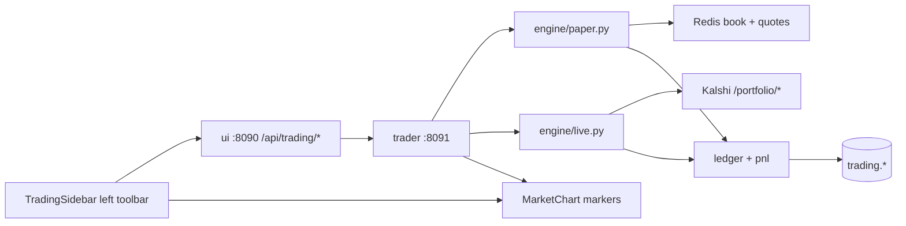

# Kalshi Trading API + UI Trading Toolbar

## Context

The repo already has the foundation but **no execution layer**:

- DB schema: [`storage/migrations/003_trading.sql`](storage/migrations/003_trading.sql) — `experiments`, `orders`, `fills`, `positions`, `round_trips`, `equity_curve`, `experiment_stats` view
- Kalshi portfolio client: [`common/kalshi/rest.py`](common/kalshi/rest.py) — `create_order`, `cancel_order`, `get_balance`, `get_positions`, `get_fills` (unused today)
- Settings stub: [`common/settings.py`](common/settings.py) — `TraderSettings` with `trading_live_enabled: false`, `UiSettings.trader_url`
- Live book in Redis: `kalshi:book:{ticker}:{yes|no}` (from fetcher)
- Existing chart: [`ui/web/src/components/MarketChart.tsx`](ui/web/src/components/MarketChart.tsx) — lightweight-charts YES price line, expanded inline from [`MarketsGrouped.tsx`](ui/web/src/components/MarketsGrouped.tsx)

Trading execution lives in a separate `trader/` process; the UI calls it through a same-origin proxy on `:8090`.



---

## Part A — `trader/` service (port 8091)

### Service layout (new)

```
trader/
├── Dockerfile
├── requirements.txt
├── config.yaml
└── app/
    ├── main.py
    ├── api.py
    ├── schemas.py
    ├── experiments.py
    ├── store.py
    ├── ledger.py
    ├── pnl.py
    └── engine/
        ├── base.py
        ├── paper.py
        └── live.py
```

Add `trader` service to [`docker-compose.yml`](docker-compose.yml) on `:8091`, depending on `redis`, `timescaledb`, `migrator`, and `fetcher`.

### API surface

Base URL: `http://localhost:8091`. OpenAPI at `/docs`.

#### Experiments

| Method | Path | Purpose |
|--------|------|---------|
| POST | `/api/experiments` | Create `{name, mode: "paper"\|"live", initial_capital}` |
| GET | `/api/experiments` | List experiments |
| GET | `/api/experiments/{id}` | Experiment detail |
| PATCH | `/api/experiments/{id}` | Update status/strategy/params |
| POST | `/api/experiments/{id}/capital` | `{set}` or `{delta}` |
| POST | `/api/experiments/{id}/reset` | Paper-only reset |
| DELETE | `/api/experiments/{id}` | Archive |

#### Orders (open / close)

Schema: `side: yes|no` + `action: buy|sell` + `type: market|limit`

| Method | Path | Body |
|--------|------|------|
| POST | `/api/experiments/{id}/orders` | `{ticker, side, action, type, qty, limit_price?, client_order_id?}` |
| DELETE | `/api/orders/{order_id}` | Cancel resting limit |
| POST | `/api/experiments/{id}/close_all` | `{ticker?}` |
| GET | `/api/experiments/{id}/orders` | Blotter |

#### Profile, cost, PnL

| Method | Path | Returns |
|--------|------|---------|
| GET | `/api/experiments/{id}/profile` | Cash, equity, realized/unrealized PnL, fees, positions with cost basis |
| GET | `/api/experiments/{id}/fills` | Fill history: `{side, action, price, qty, fee, cost, ts}` |
| GET | `/api/experiments/{id}/round_trips` | Closed/open trips for chart markers |
| GET | `/api/experiments/{id}/positions` | Open positions |
| GET | `/api/experiments/{id}/equity` | Equity curve |
| GET | `/api/experiments/{id}/stats` | Win rate, net PnL, drawdown |

**Round-trip shape (used by chart):**

```json
{
  "id": "...",
  "ticker": "KXBTC15M-...",
  "side": "yes",
  "qty": "10.00",
  "entry_ts": "2026-08-01T17:30:00Z",
  "entry_price": "0.530000",
  "exit_ts": "2026-08-01T17:42:00Z",
  "exit_price": "0.610000",
  "cost_basis": "5.30",
  "gross_pnl": "0.80",
  "fees": "0.04",
  "net_pnl": "0.76",
  "pnl_pct": "14.34",
  "exit_kind": "close"
}
```

Computed fields for UI convenience (add in API response, not stored):
- `cost_basis = qty * entry_price`
- `pnl_pct = (net_pnl / cost_basis) * 100` when closed; for open trips use unrealized PnL vs cost basis
- `action_at_entry` derived from side (buy yes / buy no) for display labels

#### Live-mode safety

1. `TRADING_LIVE_ENABLED=false` env kill switch
2. Experiment `mode=live`
3. Header `X-Confirm-Live: yes` on order POST

### Execution engines

**Paper** — fills against live Redis book; YES ask = `1 - best NO bid`; Kalshi taker fees; lifecycle settlement at $1/$0.

**Live** — `KalshiRest.create_order()` + fill reconciliation.

### Ledger

Transactional fill → position → cash → FIFO round_trips. Background mark loop writes `equity_curve`.

### Delivery sequence (backend)

1. Scaffold + compose
2. Store + experiments API
3. Ledger + PnL core
4. Paper engine + orders API
5. Profile/stats endpoints (include `pnl_pct`, `cost_basis` on round_trips)
6. Live engine
7. Unit tests

---

## Part B — UI trading toolbar + chart markers

### Layout change

Convert [`App.tsx`](ui/web/src/App.tsx) from single-column to a **fixed left sidebar + main content** grid:

```
┌──────────────────┬─────────────────────────────────────┐
│ TradingSidebar   │  header + filters + MarketsGrouped    │
│ (280px)          │  (existing market list + charts)      │
│                  │                                       │
│ experiment       │                                       │
│ PAPER badge      │                                       │
│ cash / equity    │                                       │
│ order ticket     │                                       │
│ recent fills     │                                       │
└──────────────────┴─────────────────────────────────────┘
```

On mobile (`< lg`): sidebar collapses to a slide-over drawer toggled by a "Trade" button in the sticky header.

### UI proxy (same-origin)

Browser must not call `:8091` directly (CORS + vite dev). Proxy through UI server:

**[`ui/server/trading_proxy.py`](ui/server/trading_proxy.py)** (new):
- Catch-all `GET|POST|PATCH|DELETE /api/trading/{tail:.*}`
- Forward to `{trader_url}/api/{tail}` via `aiohttp.ClientSession`
- Pass through `X-Confirm-Live` header for live orders
- Return trader JSON/errors unchanged

Register in [`ui/server/main.py`](ui/server/main.py). Add to [`ui/web/vite.config.ts`](ui/web/vite.config.ts):

```ts
"/api/trading": "http://localhost:8091"  // dev: can proxy direct; prod uses ui server forward
```

Prefer forwarding through ui server in both dev and prod so one code path.

### Frontend API client — [`ui/web/src/api/trading.ts`](ui/web/src/api/trading.ts) (new)

Types + fetch wrappers:

```ts
export type TradeSide = "yes" | "no";
export type TradeAction = "buy" | "sell";
export type OrderType = "market" | "limit";

export type Fill = {
  ts: string;
  ticker: string;
  side: TradeSide;
  action: TradeAction;
  price: string;
  qty: string;
  fee: string;
  cost: string;       // qty * price
};

export type RoundTrip = {
  id: string;
  ticker: string;
  side: TradeSide;
  qty: string;
  entry_ts: string;
  entry_price: string;
  exit_ts: string | null;
  exit_price: string | null;
  cost_basis: string;
  net_pnl: string | null;
  pnl_pct: string | null;
  exit_kind: string | null;
};

export type Profile = { /* cash, equity, realized_pnl, unrealized_pnl, positions */ };

// postOrder, fetchProfile, fetchRoundTrips, fetchFills, listExperiments, ...
```

### Trading store — [`ui/web/src/store/tradingStore.ts`](ui/web/src/store/tradingStore.ts) (new)

External store (same pattern as [`marketStore.ts`](ui/web/src/store/marketStore.ts)):

- `activeExperimentId` — persisted in `localStorage`
- `profile` — polled every 2s while sidebar open
- `fills` — last 20 fills for active experiment
- `roundTripsByTicker: Map<string, RoundTrip[]>` — fetched when chart expands
- `submitOrder(ticker, {side, action, type, qty, limit_price?})` — calls API, refreshes profile + fills + round trips on success
- `selectedTicker` — set when user expands a chart row (passed from MarketsGrouped)

On successful fill, append to fills list with explicit **`BUY YES` / `SELL NO`** label derived from `side` + `action`.

### Left toolbar — [`ui/web/src/components/TradingSidebar.tsx`](ui/web/src/components/TradingSidebar.tsx) (new)

Sections top to bottom:

1. **Experiment picker** — dropdown from `GET /api/trading/experiments`; "New paper experiment" quick-create with $10,000 default
2. **Mode badge** — `PAPER` (green) or `LIVE` (red, pulsing border); live orders require checkbox "I confirm real money"
3. **Portfolio strip** — cash, equity, realized PnL, unrealized PnL (from profile); color green/red via [`format.ts`](ui/web/src/lib/format.ts)
4. **Order ticket** (targets `selectedTicker` from expanded chart, or manual ticker input):
   - Side toggle: **YES** | **NO**
   - Action toggle: **Buy** (open) | **Sell** (close)
   - Type: **Market** | **Limit** (shows limit price input in dollars, e.g. `0.53`)
   - Qty input (contracts)
   - Submit button — disabled if no ticker, qty ≤ 0, or live without confirm
   - **Close position** button — market sell full open qty for selected ticker+side
5. **Recent fills** — scrollable list; each row:

   ```
   BUY YES · KXBTC15M-... · 10 @ 53¢ · cost $5.30 · 5:32 PM
   SELL YES · ... · 10 @ 61¢ · P&L +$0.76 (+14.3%)
   ```

   Color: buy = accent green, sell = red; show side + action prominently.

Wire sidebar into [`App.tsx`](ui/web/src/App.tsx). Pass `selectedTicker` from [`MarketsGrouped.tsx`](ui/web/src/components/MarketsGrouped.tsx) via `expandedChart` state lifted to App (or context).

### Chart entry/exit markers — extend [`MarketChart.tsx`](ui/web/src/components/MarketChart.tsx)

When chart mounts for a ticker, fetch `GET /api/trading/experiments/{id}/round_trips?ticker={ticker}` and poll every 5s (or refresh on `tradingStore` order event).

Use lightweight-charts [`series.setMarkers()`](https://tradingview.github.io/lightweight-charts/docs/api/interfaces/ISeriesApi#setmarkers):

| Event | Marker | Position | Color | Text |
|-------|--------|----------|-------|------|
| Entry (buy) | `arrowUp` | `belowBar` | `#0ECB81` (yes) / `#F6465D` (no) | `BUY YES · 53¢ · $5.30` |
| Exit (sell/close) | `arrowDown` | `aboveBar` | green if profit else red | `SELL YES · 61¢ · +$0.76 (+14.3%)` |
| Open position (no exit yet) | `arrowUp` | `belowBar` | accent | `BUY YES · 53¢ · $5.30 · open` |

**Price axis:** chart Y-axis is YES cents. Marker `time` = `Math.floor(Date.parse(entry_ts) / 1000)`. Marker `price` = `Number(entry_price) * 100` for YES-side trips; for NO-side entries plot at `(1 - entry_price) * 100` so the marker sits on the visible YES probability line (economically equivalent display).

**P&L formatting** (shared helper in [`ui/web/src/lib/pnl.ts`](ui/web/src/lib/pnl.ts)):

```ts
function formatPnl(usd: number): string {
  const sign = usd >= 0 ? "+" : "−";
  return `${sign}$${Math.abs(usd).toFixed(2)}`;
}
function formatPnlPct(pct: number): string {
  const sign = pct >= 0 ? "+" : "−";
  return `${sign}${Math.abs(pct).toFixed(1)}%`;
}
```

For closed round trips, label exit marker: `${formatPnl(net_pnl)} (${formatPnlPct(pnl_pct)})`.

Optional enhancement: thin horizontal `createPriceLine` at entry price from entry time to exit time (or now if open), dashed, labelled "cost basis".

Refresh markers when:
- User submits order from sidebar (immediate refetch)
- Poll interval fires
- Chart ticker changes

### MarketsGrouped integration

In [`MarketsGrouped.tsx`](ui/web/src/components/MarketsGrouped.tsx):

- Lift `expandedChart` to App (or use `tradingStore.setSelectedTicker(ticker)` when chart expands)
- Pass `experimentId` not needed on chart — chart reads from tradingStore

---

## Full delivery sequence

| Step | Deliverable |
|------|-------------|
| 1/10 | `trader/` scaffold + compose |
| 2/10 | Experiments + store layer |
| 3/10 | Ledger, PnL, round_trips with `cost_basis` + `pnl_pct` |
| 4/10 | Paper engine + orders API |
| 5/10 | Profile/fills/round_trips endpoints |
| 6/10 | UI proxy + `api/trading.ts` client |
| 7/10 | `tradingStore` + `TradingSidebar` layout in App |
| 8/10 | Order ticket wired to API; fills list with side/action/cost |
| 9/10 | Chart markers in MarketChart with entry/exit + P&L $/% |
| 10/10 | Live engine + smoke test (paper order from UI → marker on chart) |

## Testing

| Test | What it proves |
|------|----------------|
| `trader/tests/test_paper_fills.py` | Book-walk fills |
| `trader/tests/test_pnl.py` | FIFO + pnl_pct math |
| `ui/web/src/lib/pnl.test.ts` | $/% formatting edge cases |
| Manual smoke | Expand BTC chart → BUY YES market 10 → fill appears in sidebar → green arrow on chart with cost → SELL → exit arrow with +$/% |

## Out of scope

- User auth / multi-user
- Polymarket / CLOB
- Full blotter page / equity curve chart (sidebar shows summary only; expandable later)

## Risks

- **Book correctness:** enable `reject_if_book_stale` until orderbook seq-gap fixes land
- **NO-side chart price:** NO entries display on YES-equivalent scale `(1 - price) * 100` — document in marker tooltip ("NO @ 47¢ ≡ YES @ 53¢")
- **Marker clutter:** cap visible markers to current window's round trips; older trips from prior windows filtered by `entry_ts >= open_time`
