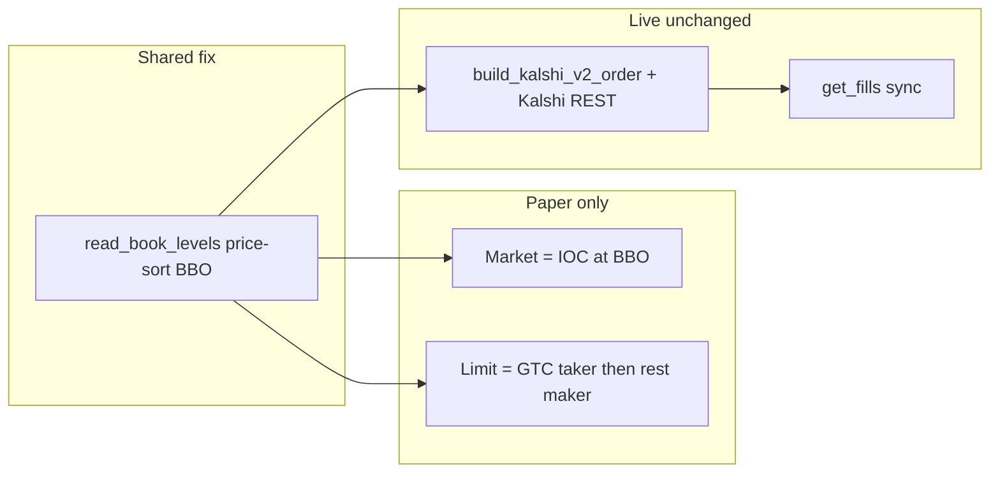
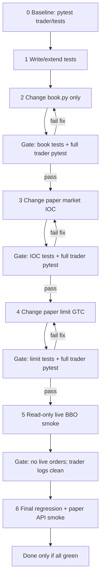

# Paper ↔ Live Kalshi Parity (minimal)

## Goal

Train on paper, then get the same fill behavior on live: same BBO, same market IOC, same GTC limit cross/rest, same fee roles. **Live money path stays exchange-authoritative** — only shared book accuracy + paper simulator changes.



## Root bugs blocking parity

1. **BBO sorted by size not price** — Redis ZSET is `member=price`, `score=size` ([storage/clients/redis_store.py](storage/clients/redis_store.py)). [`read_book_levels`](trader/app/book.py) uses `ZREVRANGE` → largest size first. Paper limits see fake ask ~99¢; live `market_to_v2` can send wrong IOC price.
2. **Paper market ≠ Kalshi IOC** — walks depth / can leave resting leftovers; live sends `immediate_or_cancel` at BBO only ([kalshi_orders_v2.py](trader/app/kalshi_orders_v2.py)).
3. **Paper limit ≠ Kalshi GTC** — marketable fills whole qty as maker, ignores depth; resting fill price/liquidity wrong ([paper.py](trader/app/engine/paper.py) `_try_limit_fill`).
4. **Typo** — `self.settings.fills` should be `self.settings.fill` (market walk can crash).

## Changes (minimal surface)

### 1. Shared — fix BBO read (required for live accuracy)

In [`trader/app/book.py`](trader/app/book.py) `read_book_levels`:
- Keep Redis schema as-is
- After load, sort bids by **price descending**
- In `get_ask_levels_for_buy`, after `1 - p` map, sort asks **ascending** (best ask first)
- Optionally drop dust sizes (`size < 1e-6`) from float ZINCRBY residue

This is the only shared change. It makes live market IOC price correct; does **not** change live submit/sync/fee_cost logic.

### 2. Paper market = Kalshi IOC (match live)

In [`trader/app/engine/paper.py`](trader/app/engine/paper.py):
- Market: fill **only top-of-book level** (same as live `market_to_v2` BBO price), taker fee
- Any unfilled qty → `cancelled` with reason `ioc` (do not rest markets)
- Fix `settings.fills` → `settings.fill` (slippage unused once BBO-only; keep field for config compat)
- Keep cash/position clamps

### 3. Paper limit = Kalshi GTC

In `paper.py`:
- **On submit / poll:** if limit crosses BBO → walk opposing depth up to limit (taker), partial OK; rest unfilled as `open`
- **Resting maker:** when later crossed, fill at **limit_price**, size ≤ available book size, `liquidity="maker"`
- Buy limits: refuse/partial when cash insufficient (mirror live preflight)

Reuse existing `_walk_book` for marketable portion; keep `check_open_limits` 0.5s loop.

### 4. Live red line — do not touch

Leave unchanged:
- [`trader/app/engine/live.py`](trader/app/engine/live.py) submit / cancel / `_sync_fills` / `fee_cost`
- [`trader/app/kalshi_orders_v2.py`](trader/app/kalshi_orders_v2.py) TIF (`IOC` market, `GTC` limit) and body shape
- Ledger accounting

Live only benefits from correct BBO via shared `book.py`.

### 5. Tests first, then gate every step

Extend [`trader/tests/test_paper_fills.py`](trader/tests/test_paper_fills.py) (and add helpers if needed) **before** behavior changes where practical:

| Test | Asserts |
|------|---------|
| BBO sort | Largest size ≠ best price → `read_book_levels` / ask helpers return best **price** |
| Ask derive | YES buy ask = `1 - best_no_bid` after price sort |
| Market IOC | Fill ≤ BBO size @ best ask; remainder status `cancelled` reason `ioc`; never rests |
| Limit rest | Buy limit below ask → `open`, filled_qty=0 |
| Limit cross | Buy limit ≥ ask → taker fill ≤ depth; unfilled stays `open` at limit; liquidity roles correct |
| Dust filter | Near-zero float sizes ignored |

Prefer pure unit tests (in-memory/fake redis or extracted sort helpers). Integration/API smoke only after unit suite is green.

## Test process (mandatory — after every change)

Work in small commits of behavior. **Do not start the next todo until the gate for the current one is green.**



### Commands to run at each gate

1. **Unit / regression (every gate):**
   ```bash
   cd /home/animo/Desktop/2026/06_b_polymarketer
   python -m pytest trader/tests -q
   ```
2. **Focused after book change:**
   ```bash
   python -m pytest trader/tests/test_paper_fills.py -q
   ```
3. **Paper API smoke (final gate only — paper experiment, no live):**
   - Limit buy **below** true ask → stays `open`
   - Limit buy **at/above** true ask → fills (or partial + rest)
   - Market buy → `filled` or `cancelled`/`ioc`, never resting `open`
4. **Live red-line check (read-only):**
   - Confirm `read_book_levels` / `market_to_v2` BBO matches ticker quote within 1 tick
   - **Do not** place live orders as part of this work
5. **Stop rule:** any pytest failure, unexpected paper status, or trader traceback → fix before continuing

### Rebuild note

If trader runs in Docker, after paper/book changes:
```bash
docker compose up -d --build trader
```
then re-run pytest (host) + paper smoke against the rebuilt service.

## Expected behavior after fix

| Order | Paper | Live |
|-------|-------|------|
| Market buy | Fill min(qty, BBO size) @ best ask, cancel rest | IOC @ BBO via Kalshi |
| Limit buy below ask | Rest open | GTC rest on Kalshi |
| Limit buy ≥ ask | Taker vs depth ≤ limit, rest maker | Same on exchange |
| Fees | Taker formula / maker_bps=0 | Exchange `fee_cost` (same formula fallback) |

## Out of scope (intentionally)

- Rewriting paper as full Kalshi v2 order-body simulator
- Changing live to walk multiple levels
- Fetcher ZSET schema migration / full float cleanup beyond dust filter
- Archive PnL work from prior session
- Placing real-money live orders during verification
