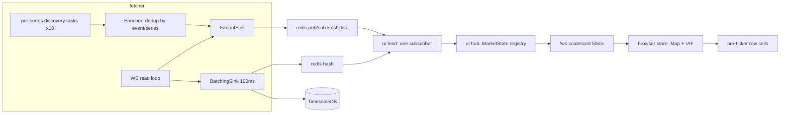

## Measured baseline

- Fanout throughput: **1047 events/sec**, `fanout_drops: 0`, fetcher `last_message_lag_ms: 0.85`. The ingest side is healthy.
- `kalshi:live` has **0 subscribers**. 125,899 frames published into the void; nothing consumes the low-latency lane.
- Browser polls `/api/markets` every 2000 ms: 676 KB response, ~100 ms server time, ~3.1 MB pulled from Redis per call (795 HGETALLs, each carrying `market`+`event`+`series` JSON blobs totalling ~3.9 KB).
- Universe: 795 tickers, **10** distinct events, **10** distinct series.
- Enrichment: 795 x 3 = **2385** sequential REST calls at `rest_rps: 10` = **~238 s** to warm up.

So essentially all observable latency is downstream of the fetcher, and essentially all cold-start delay is redundant REST work.

## Root causes

**1. Volume freezes (the "doesn't match" bug).** `_merge_volume` in [ui/server/markets.py](ui/server/markets.py) compares the live value against `market_json["volume_fp"]`, a REST blob written **once** by `Enricher.enrich_tickers` and never refreshed (the `self._seen` guard in [fetcher/app/enrich.py](fetcher/app/enrich.py) returns early forever after the first fetch):

```python
if rest_vol is not None and live_vol is not None and live_vol > rest_vol * Decimal("1.25"):
    return rest_vol
```

Once a market grows past 1.25x its enrollment-time volume it flips to the frozen number. Observed: `KXBTC15M-26AUG011245-45` served **44459.48** while the live value was **452114**. 15-minute markets trip this in every window; the hourly ladders usually do not, which is why some rows look right and some look stuck.

Verified unit relation (simultaneous read, `KXETH15M-26AUG011245-45`): REST `volume_fp` 36445.81 == WS `dollar_volume` 36947 (1.0138, real growth), while WS `volume_fp` 73895.22 is exactly 2x. Ratio is 2.0000 across 386 samples spanning $0.01-$0.99, so it is a leg-counting convention, not price weighting. `handle_ticker` already picks `dollar_volume`, which is correct; only the merge heuristic is wrong.

**2. Discovery is serial.** [fetcher/app/discovery.py](fetcher/app/discovery.py) loops the 10-series allowlist one at a time, then sleeps 15 s. One slow or failing series stalls all others.

**3. Enrichment is serial and redundant.** Per ticker it calls `get_market` + `get_event` + `get_series`. `get_market` is entirely redundant: discovery's `/markets?series_ticker=` listing already returns the full Market object (confirmed fields include `title`, `floor_strike`, `strike_type`, `volume_fp`, `open_interest_fp`, `rules_primary`, `yes_bid_dollars`). And 795 tickers map to only 10 events and 10 series, so 785 event lookups and 785 series lookups are duplicates.

**4. The fanout has no consumer**, so the UI falls back to 2 s polling. Also, `enrich_tickers` builds `MARKET_META` events and `_on_universe_change` throws the return value away, so nothing downstream ever learns about new markets.

## Target data flow



Latency budget, exchange to painted pixel: ~1 ms decode, ~0.3 ms fanout, ~0.5 ms gateway apply, ~25 ms average coalesce, ~1 ms socket, ~16 ms rAF paint = **~45 ms p50** against ~1100 ms today. Focused ticker bypasses coalescing (`market_flush_ms: 0`) for ~20 ms.

---

## 1/5 Volume correctness (smallest change, most visible)

[ui/server/markets.py](ui/server/markets.py) — delete both ratio heuristics. Live always wins; the REST blob is a cold-start fallback only, used before the first tick lands:

```python
def _merge_volume(raw: dict[str, str], market_json: dict[str, Any]) -> Decimal | None:
    # WS dollar_volume and REST volume_fp are the same quantity; WS volume_fp
    # counts both legs. The REST blob is written once at enrichment, so it is
    # only a cold-start seed - never a correction.
    live = _parse_decimal(raw.get("volume"))
    return live if live is not None else _parse_decimal(market_json.get("volume_fp"))
```

Same shape for `_merge_open_interest` against `open_interest_fp`.

Replace the misleading comment in [fetcher/app/handlers/ticker.py](fetcher/app/handlers/ticker.py) with the verified relation. Keep `dollar_volume` first.

Tests: extend [fetcher/tests/test_ticker_volume.py](fetcher/tests/test_ticker_volume.py) to assert `volume_fp == 2 * dollar_volume`, and add `ui/tests/test_markets_volume.py` reproducing the exact observed case — live `452114` with a stale REST blob of `44459.48` must serialize `452114`.

## 2/5 One discovery task per series

[fetcher/app/discovery.py](fetcher/app/discovery.py). Replace the serial loop with a task per series under one `TaskGroup`, each owning its own interval, backoff, and diff:

```python
async def run(self) -> None:
    allowlist = self.settings.filters.series_allowlist
    if not allowlist:
        await self._global_loop()          # unchanged fallback
        return
    async with asyncio.TaskGroup() as tg:
        for series in allowlist:
            tg.create_task(self._series_loop(series))
```

- `self._per_series: dict[str, set[str]]`; the universe is the union. An `asyncio.Lock` guards the merge plus the `set_universe` Redis write so concurrent scans cannot interleave.
- `scan_series()` returns the **full market dicts**, not just tickers, so enrichment reuses them for free.
- `self._wake: dict[str, asyncio.Event]` plus `request_scan(series)`. [fetcher/app/main.py](fetcher/app/main.py) calls it from the `market_lifecycle_v2` branch on `close`/`settled`/`determined`, making rollover detection event-driven instead of waiting up to 15 s.
- A per-series failure logs and retries that series only.

Steady state is 10 series / interval, so a 5 s interval costs ~2 req/s against `rest_rps: 10` — room to spare.

## 3/5 Enrichment: 2385 calls to about 32

[fetcher/app/enrich.py](fetcher/app/enrich.py). New entry point taking the listings discovery already has:

```python
async def enrich_from_markets(self, markets: list[dict]) -> list[NormalizedEvent]:
    events = {m["event_ticker"] for m in markets if m.get("event_ticker")}
    ev_meta = dict(zip(events, await asyncio.gather(
        *(self._event_cached(e) for e in events), return_exceptions=True)))
    ...
```

- Drop `get_market` per ticker entirely; build `MarketMeta` from the listing object.
- Fetch each distinct event and series **once**, concurrently, through a TTL cache, so repeat scans cost zero REST calls.
- Remove the permanent `_seen` guard on market fields; keep caching only for the static event/series metadata. Market fields then refresh every scan at no REST cost.
- Return the `MARKET_META` events and actually route them through `fanout.publish` + `sink.enqueue` in `main.py` (currently discarded), so the gateway learns about new markets without polling.
- Batch the Redis meta writes into one pipeline instead of one `hset` per ticker.
- Delete the dead duplicate [fetcher/app/kalshi/](fetcher/app/kalshi/) package while here; `enrich.py` is its only importer and `main.py` already uses `common.kalshi`.

Cold start becomes ~12 pagination calls + 10 event + 10 series, run concurrently: **~2-3 s instead of ~238 s**.

## 4/5 WebSocket gateway

Add `msgspec==0.19.0` to [ui/requirements.txt](ui/requirements.txt) — `FanoutSink` encodes msgpack and the UI currently cannot decode it.

- `ui/server/hub.py` — `MarketState` registry keyed by ticker: `meta`, `quote`, `dirty` flag, `seq`.
- `ui/server/feed.py` — cold start by calling the existing `fetch_markets` once to seed the registry (reuses all the merge logic), then `SUBSCRIBE kalshi:live`, decode with `msgspec.msgpack`, mutate state, mark dirty. Decode-and-apply only; all socket writes happen in per-client writer tasks so one slow browser cannot stall the feed. Route `market_meta`/`lifecycle` to add and remove registry entries. Keep a 10 s `SMEMBERS kalshi:universe` reconcile as a safety net.
- `ui/server/ws.py` — `/ws`, JSON frames (at ~20 coalesced frames/sec a msgpack browser dependency buys nothing; revisit if the book ladder lands). One `snapshot` frame on connect, then deltas. List view coalesces dirty tickers every `list_flush_ms` (50, already in `UiSettings`); a client-nominated focused ticker ships uncoalesced. Per-client bounded queue, drop-oldest, with a resync flag that triggers a fresh snapshot.
- [ui/server/main.py](ui/server/main.py) — register `/ws`, start the feed under an `asyncio.TaskGroup` alongside the site, add `/metrics` exposing feed lag, per-client queue depth, and drops.
- [ui/server/markets.py](ui/server/markets.py) — switch the 795 `HGETALL`s to `HMGET` of only the hot fields plus the meta blobs actually needed. Cuts the Redis read from ~3.1 MB to well under 100 KB and keeps the REST path viable as a fallback and as the snapshot source.

## 5/5 Frontend store

- [ui/web/vite.config.ts](ui/web/vite.config.ts) — add `"/ws": { target: "ws://localhost:8090", ws: true }`.
- `ui/web/src/net/socket.ts` — reconnecting client with backoff, re-sends subscription state on reconnect.
- `ui/web/src/store/marketStore.ts` — `Map<string, MarketRow>` mutated outside React, per-ticker listener sets, one `requestAnimationFrame` flush per frame. `MarketRow` shape is unchanged, so [lib/filters.ts](ui/web/src/lib/filters.ts), [lib/groupMarkets.ts](ui/web/src/lib/groupMarkets.ts) and the table components keep working.
- [ui/web/src/App.tsx](ui/web/src/App.tsx) — replace the `POLL_MS = 2000` effect with the socket; keep a single REST fetch as the pre-socket seed and as the error fallback.
- [ui/web/src/components/MarketsGrouped.tsx](ui/web/src/components/MarketsGrouped.tsx) — extract the YES/NO/volume cells into a component subscribing to its own ticker via `useSyncExternalStore`, so a tick repaints one row rather than re-running `groupMarkets` over 795 markets. Recompute grouping, aggregates and sort order on a throttled cadence (~500 ms), not per frame: at 1047 events/sec, reordering rows at frame rate is both expensive and unreadable. Default view is only ~20 expanded rows, so this stays cheap.

## Verification

- `volume` for a hot 15-minute market tracks `GET /markets?tickers=` within a percent or two for a full window, and never freezes.
- `/metrics` shows `pubsub numsub kalshi:live` at 1 and `fanout_drops` at 0.
- Cold `docker compose up --build`: list populated in seconds, not minutes; count enrichment REST calls to confirm ~32, not 2385.
- Latency stamps (`source_ts`, `t_pub` already set by `FanoutSink`, plus `t_gw`, `t_send`, browser `t_recv`) report p50 under ~50 ms.
- New window rollover appears within ~1 s of the lifecycle close event.
- `docker compose stop ui` leaves fetcher `/metrics` throughput unchanged.

## Risks

- Removing the `_merge_volume` guard means a market with no tick yet shows the REST seed; acceptable and now explicit, where before it was permanent.
- Ten concurrent series scans share one `TokenBucket`, so `rest_rps` becomes the real cold-start floor. Total calls drop ~75x, so 10 rps is comfortable, but raising it needs a check against the account's rate tier.
- `hash(ticker) % shards` in `_subscribe_tickers` uses Python's salted `hash`, so shard assignment differs per process run. Harmless today, but do not persist it.
- The existing [.cursor/plans/ui_trading_terminal_1188ed1b.plan.md](.cursor/plans/ui_trading_terminal_1188ed1b.plan.md) Step 0 book fixes (seq-gap lockup, `_apply_book` overwriting deltas with `zadd`) are still unfixed. They do not affect volume or list latency, so they stay out of scope here, but the ladder is wrong until they land.
