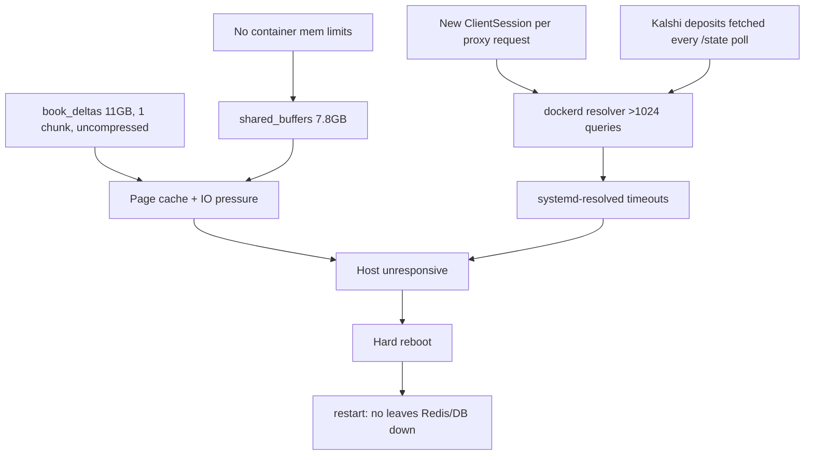

« # Two-Week Non-Stop Uptime Hardening

## Root cause recap

The host hard-rebooted at 22:21; the stack never returned because Redis and Timescale had `restart: no`. The freeze itself was host resource exhaustion, with three confirmed contributors:

- **Postgres sized itself to the whole machine.** `shared_buffers = 7805MB` (25% of 30GB) because the container has no memory limit, while `book_deltas` sat as a single **11GB uncompressed chunk**.
- **DNS saturation.** dockerd logged `[resolver] more than 1024 concurrent queries` and repeated `127.0.0.53` timeouts. Every host name lookup stalled, which is why snapd hit its watchdog and the desktop went unresponsive.
- **No restart policy** on the data plane.



## 1. Auto-recovery and real-money safety (highest priority)

Real funds are in play, so a restart must never leave local state drifted from Kalshi.

- **Reconcile on startup + on a loop.** [`trader/app/engine/live.py`](trader/app/engine/live.py) has `reconcile_positions()` (line 185), but it is only reachable from the manual endpoint at [`trader/app/api.py`](trader/app/api.py) line 725. Add it to the task list in [`trader/app/main.py`](trader/app/main.py):

```python
tasks = [
    ...
    asyncio.create_task(_every("reconcile", state, 300.0, state.live_engine.reconcile_positions)),
]
```

  `_every` runs `work()` immediately before its first sleep, so this doubles as the startup reconcile.

- **Healthchecks on the app services.** All three already expose `/healthz` ([`fetcher/app/main.py`](fetcher/app/main.py) line 332, [`trader/app/api.py`](trader/app/api.py) line 1010, [`ui/server/main.py`](ui/server/main.py) line 73) but [`docker-compose.yml`](docker-compose.yml) defines no `healthcheck` for them, so a hung-but-alive process is invisible.
- **Add an autoheal sidecar.** Docker does not restart unhealthy containers on its own; add `willfarrell/autoheal` with `AUTOHEAL_CONTAINER_LABEL=autoheal` and label the four long-running services.
- `restart: unless-stopped` is now on Redis and Timescale in [`docker-compose.yml`](docker-compose.yml) and applied live via `docker update`. Keep it.

## 2. Bound resources so the host cannot be starved

- **Explicit Postgres tuning** in the `timescaledb` service command, instead of letting it auto-size to 30GB:

```yaml
command: >
  postgres -c shared_buffers=2GB -c effective_cache_size=6GB
           -c work_mem=32MB -c maintenance_work_mem=512MB
           -c max_worker_processes=8 -c timescaledb.max_background_workers=6
```

- **Per-service memory and CPU caps** in [`docker-compose.yml`](docker-compose.yml): roughly Timescale 8G, Redis 1G, fetcher 1G, trader 1G, ui 1G. Total stays under 12G of the 30G host, leaving the desktop headroom.
- **Docker log rotation.** `/etc/docker/daemon.json` has no `log-opts`, so json logs grow without bound and Timescale logs several hundred continuous-aggregate lines per minute. Add `log-driver: json-file` with `max-size: 50m`, `max-file: 3`, preserving the existing `nvidia` runtime block. Requires a `dockerd` restart.

## 3. Make Timescale self-maintaining

New migration `storage/migrations/005_chunk_intervals.sql`:

- **Shrink chunk intervals from 7 days to 1 day** for `book_deltas`, `ticks`, `trades`. Today a weekly chunk stays open all week, so `add_compression_policy(..., INTERVAL '1 day')` from [`storage/migrations/001_init.sql`](storage/migrations/001_init.sql) line 101 can never fire, and `add_retention_policy('book_deltas', INTERVAL '7 days')` from [`storage/migrations/004_retention_archive.sql`](storage/migrations/004_retention_archive.sql) line 15 can only drop a chunk once its whole range ages out, stretching effective retention to ~14 days.

```sql
SELECT set_chunk_time_interval('book_deltas', INTERVAL '1 day');
```

- **Compress the existing backlog** with `compress_chunk()` over old chunks (currently 1 chunk, 0 compressed).
- **Tighten the continuous-aggregate refresh window.** All three policies use `start_offset => 1 hour` on a 60-second schedule, so each run re-materializes ~60 buckets. Dropping `start_offset` to 15 minutes cuts that work roughly 4x with no loss for a 1-second aggregate.

Verify afterwards: `book_deltas` should hold ~2.2GB/day in daily chunks with older ones compressed, versus the current 11GB hot chunk in a 13GB database.

## 4. Remove connection and DNS churn

- **Share one `ClientSession`** in [`ui/server/trading_proxy.py`](ui/server/trading_proxy.py). Line 29 does `async with ClientSession() as session:` per proxied request; the dashboard polls every 2-10s, so this is a new connector, DNS lookup and TCP connection every poll. Create the session once on app startup, store it in `app["http"]`, and close it in cleanup.
- **Cache Kalshi deposits.** [`trader/app/pnl.py`](trader/app/pnl.py) line 113 calls `fetch_all_kalshi_deposits(kalshi_client)` on every `build_profile`, and [`trader/app/capital.py`](trader/app/capital.py) line 44 has no cache, so a paginated API walk runs on every `/state` poll. Reuse the TTL-cache pattern already in [`trader/app/fill_analysis.py`](trader/app/fill_analysis.py) lines 13-15, with a longer TTL (deposits change rarely):

```python
_DEPOSITS_TTL_S = 600.0
```

- Leave the `KalshiRest` clients alone: `LiveEngine._client()` already memoizes its `httpx.AsyncClient`, and streams are correctly capped at `maxlen=100_000` in [`storage/clients/redis_store.py`](storage/clients/redis_store.py) line 101 (Redis is at 62MB of its 512MB limit).

## 5. Disk reclaim and monitoring

- **Reclaim ~247GB**: 1208 dangling volumes (~216GB), stale images (~20.7GB), build cache (~10.4GB). Run `docker volume prune`, `docker image prune -a`, `docker builder prune` after confirming the three named Timescale volumes (`06_b_polymarketer_timescale_data`, `interacticebroker_timescaledb_data`, `time_database_v2_timescale_data`) are untouched. Disk goes from 61% used to roughly 34%.
- **Watchdog script** `ops/watchdog.sh` on a 5-minute cron: poll the three `/healthz` endpoints, check root disk stays under 85%, check Redis `used_memory` against `maxmemory`, and check that `book_deltas` chunk count is growing and compressing. Log to a file and send an alert on failure so a silent stall during the 14 days is visible.

## Verification

1. `docker compose up -d`, then confirm all five services report `healthy`.
2. Reboot test: `sudo reboot`, then verify the full stack self-recovers with no manual `docker compose up`.
3. Kill test: `docker kill trader`, confirm it restarts and that the reconcile loop logs a position reconcile within 5 minutes.
4. After 24 hours: `book_deltas` shows multiple daily chunks with older ones compressed, Timescale RSS stays under its 8G cap, and `df -h /` is flat.
» 