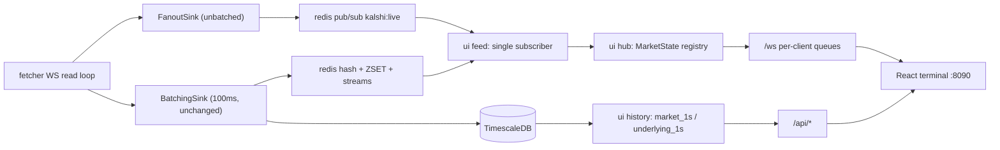

// ... existing code ...
# UI Trading Terminal (`ui/` service)

Supersedes Part II of [.cursor/plans/kalshi_live_data_pipeline_eb81cec6.plan.md](.cursor/plans/kalshi_live_data_pipeline_eb81cec6.plan.md), rewritten against the code that is actually on disk. Framework decision: **aiohttp**, matching [fetcher/app/main.py](fetcher/app/main.py) exactly, no new web dependency.

## What already exists (do not rebuild)

- [fetcher/app/sinks/fanout_sink.py](fetcher/app/sinks/fanout_sink.py) publishes msgpack frames to `kalshi:live`, unbatched, wired into `_route_ws_message`. `ui_fanout: true` is already in [fetcher/config.yaml](fetcher/config.yaml).
- [storage/migrations/002_ui.sql](storage/migrations/002_ui.sql) has `market_1s`, `underlying_1s`, `idx_underlying_symbol_ts`, and `v_market_card` (floor/cap strike, `rules_primary`, event/series titles).
- `UiSettings` is already in [common/settings.py](common/settings.py) with `port: 8090`, `list_flush_ms: 50`, `market_flush_ms: 0`, `trade_ring_size: 200`, `history_windows`, `symbol_map`, `trader_url`.
- Handlers already populate `source_ts` from exchange timestamps; `FanoutSink._frame` already adds `t_pub` and strips `raw`.

So the remaining work is: four fixes outside `ui/`, then the `ui/` folder itself.

## Wire format, fixed once

Every price crosses the wire as `price_e4` — an integer of ten-thousandths of a dollar, `round(Decimal(dollars) * 10_000)`. Kalshi's `"0.53"` becomes `5300`; BTC at `88207.22` becomes `882072200`. No float ever touches the price path, matching the Decimal-only rule the fetcher already follows. Cents for display are `e4 / 100`.

`FanoutSink` encodes with `msgspec.msgpack.Encoder(enc_hook=str)`, so `payload` Decimals arrive as **strings** and `ts` / `source_ts` arrive as msgpack datetime extensions. The gateway converts once, on ingest, and never again.

## Architecture



Latency budget, exchange timestamp to painted pixel, on localhost:

- Kalshi WS to fetcher decode: about 1 ms
- fetcher to Redis pub/sub, fire and forget: about 0.3 ms
- Redis to gateway decode and state apply: about 0.5 ms
- gateway to browser, focused market, uncoalesced: about 1 ms
- browser decode to canvas paint, next animation frame: 16 ms or less
- p50 total: about 20 ms

---

# Step 0/12 — Fix the book path before building anything on it

These are small and surgical, but the ladder and the detail page are wrong or actively harmful without them.

**0a. Sequence-gap lockup** — [fetcher/app/handlers/orderbook.py](fetcher/app/handlers/orderbook.py). On a gap the handler returns before `self.last_seq[ticker] = seq`, so `prev` freezes and every later delta is also a gap. Combined with `main.py` awaiting `resync_orderbook` inline, one gap becomes a REST call per book message inside the WS read loop, forever. Fix: drop the ticker's seq so the next snapshot re-establishes it, and stop treating a resync-in-flight as a fresh gap.

```python
if prev is not None and seq != prev + 1:
    self.seq_gaps += 1
    self.last_seq.pop(ticker, None)   # snapshot re-establishes the sequence
    self.stale.add(ticker)            # suppress duplicate gap events until resync lands
    return [NormalizedEvent(kind=EventKind.LIFECYCLE, ...)]
```

**0b. Deltas overwrite sizes** — [storage/clients/redis_store.py](storage/clients/redis_store.py) `_apply_book`. `pipe.zadd(key, {price: float(delta)})` *sets* the level to the delta instead of accumulating it, and `delta == 0` means "no change", not "remove the level". The UI cold-starts from these ZSETs, so the ladder is wrong at the source.

```python
else:
    price, delta = p.get("price"), p.get("delta")
    if price is not None and delta:
        pipe.zincrby(key, float(delta), str(price))
        pipe.zremrangebyscore(key, "-inf", 0)   # a level walked to zero is gone
```

**0c. Resync throws the snapshot away** — [fetcher/app/enrich.py](fetcher/app/enrich.py) `resync_orderbook` fetches `GET /markets/{ticker}/orderbook`, marks `book_stale`, logs, and discards the result, so a gapped book never recovers. Change it to return `BOOK_SNAPSHOT` events built with the same shape `OrderbookState._snapshot` produces (`{"side", "levels": [{"price","size"}], "seq"}`), clear the `book_stale` flag, and have `main.py` route them through `fanout.publish` + `sink.enqueue`. Move the call off the read loop with `asyncio.create_task` plus a per-ticker in-flight guard so a burst of gaps cannot fan out into a REST storm.

**0d. Wrong subscription id** — [fetcher/app/main.py](fetcher/app/main.py) `_subscribe_tickers` hardcodes `sid = 1`, but [common/kalshi/ws.py](common/kalshi/ws.py) never reads the `subscribed` ack, and `run()` already opened a market-less subscription before any ticker is known. So `update_subscription` mutates the wrong subscription and newly discovered tickers may never receive `orderbook_delta`. Fix: capture the ack in `KalshiWebSocket` and look the sid up per channel.

```python
# common/kalshi/ws.py, inside the read loop before on_message
if data.get("type") == "subscribed":
    msg = data.get("msg") or {}
    self.sids[msg.get("channel")] = msg.get("sid")
```

Then `_subscribe_tickers` uses `ws.sids.get("orderbook_delta")` and skips the update if the ack has not arrived yet, re-queuing the batch.

**0e. Pre-flight verification** (10 minutes, before writing UI code). With the stack up:

- `redis-cli --raw SUBSCRIBE kalshi:live | head -50` — confirm `orderbook_delta` and `ticker` frames both appear.
- `redis-cli XREVRANGE kalshi:stream:underlying + - COUNT 5` — read the **actual** `symbol` strings from `pyth_value` / `cfbenchmarks_value`. `UiSettings.symbol_map` currently guesses `BTC/USD`; if the feed says something else, that map is wrong and the candlestick chart will be empty. Fix the map now, not after the chart looks broken.
- `psql -c "select ticker, series_ticker, floor_strike, rules_primary is not null from v_market_card limit 5"` — confirm strikes are populated, since that is where "Price to beat" comes from.

*Done when:* `/metrics` shows `orderbook_seq_gaps` stable rather than climbing every message, `fanout_published` tracks `messages_received`, and `ZRANGE kalshi:book:{t}:yes 0 -1 WITHSCORES` shows plausible sizes.

---

# Step 1/12 — Scaffold `ui/`

```
ui/
├── Dockerfile
├── requirements.txt
├── config.yaml
├── server/
│   ├── __init__.py
│   ├── main.py       # aiohttp Application + uvloop + TaskGroup + SPA static
│   ├── codec.py      # msgpack encode/decode, e4 helpers
│   ├── hub.py        # MarketState registry, subscriber fanout
│   ├── feed.py       # kalshi:live reader + cold-start rehydrate
│   ├── ws.py         # /ws handler
│   ├── rest.py       # /api/* from memory
│   └── history.py    # asyncpg on market_1s / underlying_1s / v_market_card
└── web/              # Vite app, steps 5-11
```

`ui/requirements.txt` — same pins as [fetcher/requirements.txt](fetcher/requirements.txt), minus Kalshi-only deps: `uvloop==0.21.0`, `redis==5.2.1`, `asyncpg==0.30.0`, `msgspec==0.19.0`, `structlog==24.4.0`, `pydantic==2.10.4`, `pydantic-settings==2.7.0`, `PyYAML==6.0.2`, `aiohttp==3.11.11`.

`ui/config.yaml` mirrors the `UiSettings` fields that already exist, with the `symbol_map` corrected by step 0e.

`server/main.py` follows `FetcherApp` exactly: `asyncio.set_event_loop_policy(uvloop.EventLoopPolicy())`, `setup_logging(debug=..., level=...)`, one `asyncio.TaskGroup`, signal handlers, and `/healthz` + `/metrics` returning the same JSON shape as the fetcher's. Routes register in order: `/api/*`, `/ws`, `/assets/*` static, then a catch-all serving `index.html` so `/m/:ticker` deep links work.

`UiSettings.load()` defaults to `ui/config.yaml`, so the container runs from `WORKDIR /app` with `python -m ui.server.main`.

# Step 2/12 — The hub: one Redis reader, one in-memory truth

`server/hub.py`. The central design call: **one** pub/sub connection for the process, never one per browser.

```python
@dataclass(slots=True)
class MarketState:
    ticker: str
    meta: dict                          # v_market_card row: title, strike, rules, close_time
    quote: dict                         # yes_bid/yes_ask/last/volume/oi as price_e4 ints
    book: dict[str, dict[int, int]]     # "yes"|"no" -> {price_e4: size}
    trades: deque                       # bounded trade_ring_size, newest first
    stale: bool                         # book_stale from the seq-gap flag
    seq: int                            # bumped on every mutation, for delta framing
```

`server/feed.py` runs two phases:

**Cold start**, before the first socket is accepted, so page load costs zero round trips:
1. `SMEMBERS kalshi:universe`
2. one `SELECT * FROM v_market_card WHERE ticker = ANY($1)` for all meta at once — cleaner than parsing the JSON blobs `upsert_market_meta` writes into the Redis hash
3. one pipeline of `HGETALL kalshi:market:{t}` for quotes and `book_stale`
4. one pipeline of `ZRANGE kalshi:book:{t}:{yes,no} 0 -1 WITHSCORES`
5. `XREVRANGE kalshi:stream:trades + - COUNT n` for tape backfill

**Live loop**: `SUBSCRIBE kalshi:live`, decode, mutate `MarketState`, mark dirty, hand to interested client queues. Decode-and-apply only — every socket write happens in a per-client writer task, mirroring the fetcher's read-loop discipline so one slow browser cannot stall the feed.

Routing by `kind`: `tick` updates `quote`; `trade` pushes the ring; `book_snapshot` replaces a side and clears `stale`; `book_delta` does `size += delta` and deletes the level at `<= 0`; `underlying` keys off `payload["symbol"]`, **not** `ticker` (the underlying handlers set `ticker = symbol`); `lifecycle` adds or removes from the registry on `close` / `settled` / `determined`, so the list self-maintains without polling; `market_meta` merges new metadata.

# Step 3/12 — WebSocket protocol

`server/ws.py`, `aiohttp.web.WebSocketResponse`, binary msgpack via `send_bytes`.

Client to server: `{"op":"sub","view":"list"}`, `{"op":"sub","view":"market","ticker":"KXBTC15M-26AUG010100"}`, `{"op":"vis","tickers":[...]}` (the rows actually on screen), `{"op":"ping","t":<epoch_ms>}`.

Server to client: one `snapshot` frame per subscribe, then deltas.

```json
{"t":"q","m":"KXBTC15M-26AUG010100","yb":5300,"ya":5500,"lp":5400,"v":128400,"oi":9100,"st":1754000000123,"tp":...,"tg":...}
{"t":"b","m":"...","s":"yes","p":5300,"z":142}
{"t":"x","m":"...","p":5400,"c":25,"k":"yes"}
{"t":"u","sym":"BTC/USD","p":882072200}
{"t":"l","m":"...","e":"settled"}
```

Two policies, and this is the point of the design:

- **List view is coalesced.** Per-client `dirty: set[str]` flushed every `list_flush_ms` (50 ms) as one frame, restricted to tickers the client reported visible. 500 markets at 5 updates/sec is 2500 msg/s of churn; coalescing makes it about 20 frames/s.
- **Focused market is never coalesced** (`market_flush_ms: 0`). Every event for the open ticker ships the instant it lands. That is where latency is visible and where we spend it.

Per-client queue is bounded and **drop-oldest with a resync flag**: a browser that falls behind gets stale deltas discarded and a fresh snapshot, rather than an unbounded queue. A slow client degrades only itself.

# Step 4/12 — REST for everything that is not hot

`server/rest.py` reads hub memory (no Redis, no SQL, sub-millisecond). Only history touches Timescale, via `server/history.py` and a `TimescaleStore`-style asyncpg pool.

- `GET /api/markets` — universe with live quotes, from memory
- `GET /api/markets/{ticker}` — meta, quote, book, strike, rules
- `GET /api/markets/{ticker}/history?range=15m` — odds line from `market_1s`, mid computed at query time as `(yes_bid + yes_ask) / 2`
- `GET /api/markets/{ticker}/underlying?range=15m` — candles from `underlying_1s`, symbol resolved through `symbol_map[series_ticker]`; returns empty when there is no mapping, and the UI then shows odds only, exactly as Kalshi does for non-crypto
- `GET /api/markets/{ticker}/trades?limit=200` — tape backfill
- `GET /api/series/{series}/past?limit=7` — settled prior windows for the Past tab: `markets` where `series_ticker = $1 AND close_time < now()`, outcome from `lifecycle_events.payload->'raw'->>'result'`, falling back to last `market_1s.close >= 0.5`
- `GET /healthz`, `GET /metrics`

Range parsing is shared: `5m|15m|1h` to an interval, bucket width scaled so a range never returns more than a few thousand points.

# Step 5/12 — Frontend scaffold and the visual language

Vite + React 18 + TypeScript + Tailwind. `vite.config.ts` proxies `/api` and `/ws` to `:8090` so `npm run dev` hot-reloads against the live pipeline.

Design tokens, dark trading terminal:
- canvas `#0B0E11`, panels `#12161C`, hairlines `#1E242E`, muted text `#7A8798`
- YES `#0ECB81`, NO `#F6465D`, accent `#4C8DFF`
- Inter for text, JetBrains Mono with `font-variant-numeric: tabular-nums` for every number, so digits never reflow as they tick
- dense 28 px rows, 12/13 px type, generous letter-spacing on labels only
- change flashes are 180 ms background fades applied by toggling a class on the DOM node, never React state
- keyboard: `/` focus search, `j`/`k` move rows, `Enter` open, `Esc` back

Routes `/` and `/m/:ticker`.

# Step 6/12 — The store lives outside React

`web/src/store/market-store.ts`. React cannot re-render a list at market data rates, so it never sees them:

- a plain `Map<string, MarketState>` mutated directly by the socket handler
- `subscribe(ticker, cb)` — **per-ticker** listeners, so a tick on one market notifies exactly one row
- the socket marks tickers dirty; a single `requestAnimationFrame` flush notifies dirty listeners and clears the set, so ten updates inside one frame cost one paint
- components read through `useSyncExternalStore`: no context, no reducer, no parent re-render

The genuinely hot widgets, the ladder and the chart, skip this entirely and draw to canvas.

`web/src/net/socket.ts` handles reconnect with backoff, msgpack decode via `@msgpack/msgpack`, and re-sends the current subscription on reconnect.

# Step 7/12 — Market list screen

Virtualized with `@tanstack/react-virtual`: only visible rows mount, and only visible rows are subscribed server-side via the `vis` op. Per row: title, YES and NO cents with spread, last, volume, open interest, and a live countdown to close driven by one shared 250 ms interval rather than a timer per row. Sort defaults to soonest-close-first, which is what matters in a 3-hour universe. Filters for series, category, and "closing under 15m". Cells flash green or red on change.

# Step 8/12 — Market detail screen, matched to the Kalshi page

Reference layout, `kalshi.com/markets/kxbtc15m/bitcoin-price-up-down/kxbtc15m-26aug010100`:

- **Header** — event title ("Bitcoin price up or down"), a `LIVE` badge, 24h volume, countdown to close
- **Price to beat** — `$88,207.22` from `v_market_card.floor_strike`, pinned above the chart and drawn on it
- **Chart panel** (step 9) with `5m / 15m / 1H` range tabs
- **YES / NO cards** — large cents plus implied percentage, best bid and ask, straight off the store
- **Order book** (step 10) — yes and no ladders with cumulative depth bars, dimmed with a `STALE` chip when `MarketState.stale`
- **Recent activity** — trade tape coloured by taker side
- **Rules** — the CF Benchmarks settlement text from `rules_primary`
- **Past** — last 7 settled windows for the series with outcomes
- **Order ticket** — rendered and visibly disabled in phase 1; the `trader_url` field already in `UiSettings` is where step 23 of the existing plan plugs in

# Step 9/12 — The chart

`lightweight-charts` (TradingView, canvas, about 45 KB) in `components/PriceChart.tsx`:

- candlestick series, underlying from `underlying_1s`
- `createPriceLine` for the dashed price-to-beat strike
- a line series on the right scale for YES probability (mid), so odds and spot react in one viewport
- seed once with `setData(history)`, then **only ever** `series.update(bar)` from the socket. Calling `setData` per tick is the classic mistake that turns a 60 fps chart into a 5 fps one.
- the live `underlying` deltas fold into the current 1-second bucket client-side, so the chart moves at feed rate rather than waiting on the continuous aggregate's 1-minute refresh
- range tabs re-fetch history while live updates continue underneath

# Step 10/12 — Ladder and tape on raw canvas

`BookLadder.tsx` mounts a `<canvas>`, reads `MarketState.book` on rAF, and paints price, size and cumulative depth bars itself. The book is the highest-churn widget on the page and keeping it out of the DOM is the difference between smooth and janky. It also renders the **derived** YES ask: Kalshi's book holds bids on both sides, so `yes_ask = 1 - no_bid`. Getting that backwards is the single easiest way to make the whole page lie. `TradeTape.tsx` does the same against the bounded trade ring.

# Step 11/12 — Prove the latency

Each frame carries `source_ts` (exchange), `t_pub` (already stamped by `FanoutSink`), `t_gw` (feed receive), `t_send` (socket write); the browser adds `t_recv` and `t_paint` from `performance.timeOrigin + performance.now()`. A corner HUD shows live p50/p99 per hop plus frame time and message rate, and `/metrics` exposes the server-side halves. Without this, "low latency" is an assertion; with it, it is a number to regress against.

# Step 12/12 — Ship it

`ui/Dockerfile`, multi-stage, same conventions as [fetcher/Dockerfile](fetcher/Dockerfile) (non-root `appuser`, `PYTHONPATH=/app`, `common/` and `storage/` copied in):

```dockerfile
FROM node:22-alpine AS web
WORKDIR /web
COPY ui/web/package*.json ./
RUN npm ci
COPY ui/web .
RUN npm run build

FROM python:3.12-slim
WORKDIR /app
RUN useradd -m -u 1000 appuser
COPY ui/requirements.txt /app/ui/requirements.txt
RUN pip install --no-cache-dir -r /app/ui/requirements.txt
COPY common /app/common
COPY storage /app/storage
COPY ui /app/ui
COPY --from=web /web/dist /app/ui/web/dist
ENV PYTHONPATH=/app PYTHONUNBUFFERED=1
USER appuser
CMD ["python", "-m", "ui.server.main"]
```

Compose service `ui` on `8090` (8080 belongs to the fetcher), build context the repo root, `env_file: .env`, `REDIS_URL` and `TIMESCALE_DSN` matching the fetcher's, `./ui/config.yaml` mounted read-only, `depends_on` redis and timescaledb healthy plus migrator completed. README gains a `ui` row in the services table and the two screen URLs.

## Acceptance criteria

- Cold `docker compose up --build`, open `:8090`, and the list is populated on first paint because the hub pre-warmed.
- Open a `KXBTC15M` market: candles, price-to-beat line, odds overlay, ladder and tape all live.
- HUD p50 exchange-to-paint under about 30 ms locally, p99 under about 80 ms.
- List holds 60 fps with 500+ markets streaming.
- `docker compose stop ui` does not perturb fetcher throughput or `/metrics`.
- After step 0, `orderbook_seq_gaps` no longer climbs monotonically and ladder sizes match `GET /markets/{ticker}/orderbook`.

## Risks

- **`symbol_map` is a guess.** Step 0e settles it against real feed data. If no crypto underlying feed arrives at all, the candle panel is empty and the chart falls back to the odds line only.
- **`resync_orderbook` currently never repairs anything**, so if step 0 is skipped the ladder drifts permanently after the first gap.
- **`fetcher/app/kalshi/` is dead code** — `main.py` imports `common.kalshi` while `enrich.py` still imports `fetcher.app.kalshi.rest`, giving two module objects for one class. Harmless today, worth deleting while touching `enrich.py` in step 0c.
- **`WebSocketPool.queue_depth` reports the outbound send queue**, not inbound backlog, so it is not the saturation signal it looks like. The gateway exposes its own real queue depths instead.
